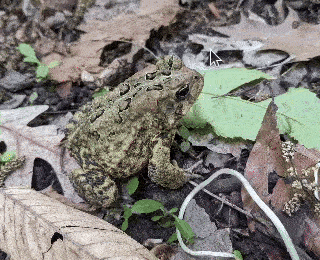
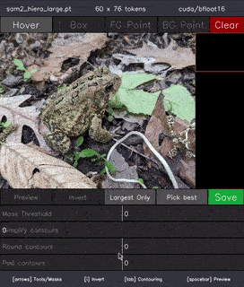
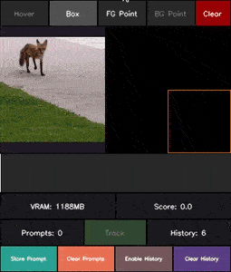

# MuggledSAM

This repo contains a simplified implementation of the awesome 'Segment Anything' models from [facebookresearch](https://ai.meta.com/research/#projects) ([SAM1](https://github.com/facebookresearch/segment-anything), [SAM2](https://github.com/facebookresearch/sam2) & [SAM3](https://github.com/facebookresearch/sam3)), with the intention of [removing the magic](https://en.wikipedia.org/wiki/Muggle) from the original code base to make it easier to understand. Most of the changes come from separating/simplifying the different components of the model structure.

<p align="center">
  
</p>

While the focus of this implementation is on interactivity and readability of the model code, it includes support for arbitrary input resolutions, which can improve performance in some cases. For example, at reduced resolutions, SAMv2 gets a [~4x speed up](https://github.com/heyoeyo/muggled_sam/tree/main/simple_examples#video-segmentation) on video segmentation.

There is a written walkthrough explaining the structure of the [SAMv1 model](https://github.com/heyoeyo/muggled_sam/tree/main/muggled_sam/v1_sam), with documentation for v2 on the way! Support for SAMv3 is currently limited to the functionality found in the v1 & v2 models (e.g. directed image & video segmentation).


## Getting started

This repo includes two demo scripts, [run_image.py](https://github.com/heyoeyo/muggled_sam/blob/main/run_image.py) and [run_video.py](https://github.com/heyoeyo/muggled_sam/blob/main/run_video.py) (along with a number of [simple examples](https://github.com/heyoeyo/muggled_sam/tree/main/simple_examples) and [experiments](https://github.com/heyoeyo/muggled_sam/tree/main/experiments)). To use these scripts, you'll first need to have [Python](https://www.python.org/) (v3.10+) installed, then set up a virtual environment and install some additional requirements.

### Install
Using a terminal, first create and activate a virtual environment (do this inside the repo folder after [cloning/downloading](https://docs.github.com/en/repositories/creating-and-managing-repositories/cloning-a-repository) it):
```bash
# For linux or mac:
python3 -m venv .env
source .env/bin/activate

# For windows (cmd):
python -m venv .env
.env\Scripts\activate.bat
```

Then install the requirements (or you could install them manually from the [requirements.txt](https://github.com/heyoeyo/muggled_sam/blob/main/requirements.txt) file):
```bash
pip install -r requirements.txt
```

<details>
<summary>Additional info for GPU usage</summary>

If you're using Windows and want to use an Nvidia GPU or if you're on Linux and don't have a GPU, you'll need to use a slightly different install command to make use of your hardware setup. You can use the [Pytorch installer guide](https://pytorch.org/get-started/locally/) to figure out the command to use. For example, for GPU use on Windows it may look something like:
```bash
pip3 uninstall torch  # <-- Do this first if you already installed from the requirements.txt file
pip3 install torch --index-url https://download.pytorch.org/whl/cu121
```

**Note**: With the Windows install as-is, you may get an error about a `missing c10.dll` dependency. Downloading and installing this [mysterious .exe file](https://aka.ms/vs/16/release/vc_redist.x64.exe) seems to fix the problem.

</details>

#### Install from Github

It's also possible to install this repo directly from Github:
```bash
# Be sure to activate a virtual environment before installing!
pip install git+https://github.com/heyoeyo/muggled_sam
```
This will make the repo available as a library (e.g. to use models in another project), though the demo scripts will not be available through this installation method.


### Model Weights

Before you can run a model, you'll need to download it's weights. There are 3 supported SAMv1 models (vit-base, vit-large and vit-huge), four v2/v2.1 models (tiny, small, base-plus and large) and 1 SAMv3 model. This repo uses the exact same weights as the original implementations (or any fine-tuned variant of the original models), which can be downloaded from the **Model Description** section of the [SAMv2 repo](https://github.com/facebookresearch/sam2?tab=readme-ov-file#model-description) (config files are not needed, only the checkpoints) and the **Model Checkpoints** section of the [SAMv1 repo](https://github.com/facebookresearch/segment-anything?tab=readme-ov-file#model-checkpoints). The v3 weights require (as of Dec 2025) signing an agreement before downloading, see the [SAMv3 repo](https://github.com/facebookresearch/sam3?tab=readme-ov-file#getting-started) for more details.

After downloading a model file, you can place it in the `model_weights` folder of this repo or otherwise just keep note of the file path, since you'll need to provide this when running the demo scripts. If you do place the file in the [model_weights](https://github.com/heyoeyo/muggled_sam/tree/main/model_weights) folder, then it will auto-load when running the scripts.

<details>

<summary>Direct download links</summary>

The tables below include direct download links to all of the supported models. **Note:** These are all links to the original repos, none of these files belong to MuggledSAM!

| SAMv3 Model | Size (MB) |
| -----| -----|
| [sam3](https://huggingface.co/facebook/sam3/resolve/main/sam3.pt?download=true) | 3290 |

| SAMv2.1 Models | Size (MB) |
| -----| -----|
| [sam2.1_hiera_tiny](https://dl.fbaipublicfiles.com/segment_anything_2/092824/sam2.1_hiera_tiny.pt) | 160 |
| [sam2.1_hiera_small](https://dl.fbaipublicfiles.com/segment_anything_2/092824/sam2.1_hiera_small.pt) | 185 |
| [sam2.1_hiera_base_plus](https://dl.fbaipublicfiles.com/segment_anything_2/092824/sam2.1_hiera_base_plus.pt) | 325 |
| [sam2.1_hiera_large](https://dl.fbaipublicfiles.com/segment_anything_2/092824/sam2.1_hiera_large.pt) | 900 |

| SAMv2 Models | Size (MB) |
| -----| -----|
| [sam2_hiera_tiny](https://dl.fbaipublicfiles.com/segment_anything_2/072824/sam2_hiera_tiny.pt) | 160 |
| [sam2_hiera_small](https://dl.fbaipublicfiles.com/segment_anything_2/072824/sam2_hiera_small.pt) | 185 |
| [sam2_hiera_base_plus](https://dl.fbaipublicfiles.com/segment_anything_2/072824/sam2_hiera_base_plus.pt) | 325 |
| [sam2_hiera_large](https://dl.fbaipublicfiles.com/segment_anything_2/072824/sam2_hiera_large.pt) | 900 |

| SAMv1 Models | Size (MB) |
| -----| -----|
| [sam-vit-base](https://dl.fbaipublicfiles.com/segment_anything/sam_vit_b_01ec64.pth) | 375 |
| [sam-vit-large](https://dl.fbaipublicfiles.com/segment_anything/sam_vit_l_0b3195.pth) | 1250 |
| [sam-vit-huge](https://dl.fbaipublicfiles.com/segment_anything/sam_vit_h_4b8939.pth) | 2560 |

</details>

### Simple Example
Here's an [example](https://github.com/heyoeyo/muggled_sam/tree/main/simple_examples/image_segmentation.py) of using the model to generate masks from an image:
```python
import cv2
from muggled_sam.make_sam import make_sam_from_state_dict

# Define prompts using 0-to-1 xy coordinates
# -> (0,0) is top-left, (1,1) is bottom-right
box_xy1xy2s = []  # Example [((0.25, 0.25), (0.75, 0.75))]
fg_xys = [(0.5, 0.5)]
bg_xys = []

# Load image & model
image_bgr = cv2.imread("/path/to/image.jpg")
_, model = make_sam_from_state_dict("/path/to/model.pth")

# Process data
encoded_img, _, _ = model.encode_image(image_bgr)
encoded_prompts = model.encode_prompts(box_xy1xy2s, fg_xys, bg_xys)
mask_preds, iou_preds = model.generate_masks(encoded_img, encoded_prompts)
```

## Run Image

<p align="center">
  
</p>

The `run_image.py` script will run the segment-anything model on a single image with an interactive UI running locally. To use the script, make sure you've activated the virtual environment (from the installation step) and then, from the repo folder use:
```bash
python run_image.py
```

You can also add  `--help` to the end of this command to see a list of additional flags you can set when running this script. For example, two interesting options are the `--crop` flag to interactively crop an image prior to processing and the `-b` flag, which can change the processing resolution of the model.

If you don't provide an image path (using the `-i` flag), then you will be asked to provide one when you run the script, likewise for a path to the model weights. Afterwards, a window will pop-up, with options for how to 'prompt' the model (e.g. bounding boxes or clicking to add points) along the top and various sliders to alter the segmentation results at the bottom. Results can be saved by pressing the `s` key.


## Run Video (or webcam)


<p align="center">
  
</p>


The `run_video.py` script allows for segmentation of videos using an interactive UI running locally. However, it only works with SAMv2 models!
To use the script, make sure you've activated the virtual environment (from the installation step) and then, from the repo folder use:
```bash
python run_video.py
```

As with the image script, you can add `--help` to the end of this command to see a list of additional flags. For example, you can add the flag `--use_webcam` to run segmentation on a live webcam feed. Using `-b 512` to reduce the processing resolution can provide a significant speed up if needed (box prompting works better at reduced resolutions btw!). 

The per-frame segmentation results can be saved as .pngs (in a TAR archive) or as an .mp4 video file (using `--ffmpeg`), please see [video_from_frames.md](.readme_assets/video_from_frames.md) for more info.

This script is a messy work-in-progress for now, more features & stability updates to come! If you'd like a more hackable solution, check out the (much easier to follow) [video segmentation example](https://github.com/heyoeyo/muggled_sam/blob/main/simple_examples/video_segmentation.py).


# Acknowledgements

The code in this repo is entirely based off the original segment-anything github repos:

[facebookresearch/segment-anything](https://github.com/facebookresearch/segment-anything)
```
@article{kirillov2023segany,
  title={Segment Anything},
  author={Kirillov, Alexander and Mintun, Eric and Ravi, Nikhila and Mao, Hanzi and Rolland, Chloe and Gustafson, Laura and Xiao, Tete and Whitehead, Spencer and Berg, Alexander C. and Lo, Wan-Yen and Doll{\'a}r, Piotr and Girshick, Ross},
  journal={arXiv:2304.02643},
  year={2023}
}
```


[facebookresearch/sam2](https://github.com/facebookresearch/sam2)
```bibtex
@article{ravi2024sam2,
  title={SAM 2: Segment Anything in Images and Videos},
  author={Ravi, Nikhila and Gabeur, Valentin and Hu, Yuan-Ting and Hu, Ronghang and Ryali, Chaitanya and Ma, Tengyu and Khedr, Haitham and R{\"a}dle, Roman and Rolland, Chloe and Gustafson, Laura and Mintun, Eric and Pan, Junting and Alwala, Kalyan Vasudev and Carion, Nicolas and Wu, Chao-Yuan and Girshick, Ross and Doll{\'a}r, Piotr and Feichtenhofer, Christoph},
  journal={arXiv preprint},
  year={2024}
}
```

[facebookresearch/sam3](https://github.com/facebookresearch/sam3?tab=readme-ov-file#getting-started)
```bibtex
@misc{
  carion2025sam3segmentconcepts,
  title={SAM 3: Segment Anything with Concepts},
  author={Nicolas Carion and Laura Gustafson and Yuan-Ting Hu and Shoubhik Debnath and Ronghang Hu and Didac Suris and Chaitanya Ryali and Kalyan Vasudev Alwala and Haitham Khedr and Andrew Huang and Jie Lei and Tengyu Ma and Baishan Guo and Arpit Kalla and Markus Marks and Joseph Greer and Meng Wang and Peize Sun and Roman Rädle and Triantafyllos Afouras and Effrosyni Mavroudi and Katherine Xu and Tsung-Han Wu and Yu Zhou and Liliane Momeni and Rishi Hazra and Shuangrui Ding and Sagar Vaze and Francois Porcher and Feng Li and Siyuan Li and Aishwarya Kamath and Ho Kei Cheng and Piotr Dollár and Nikhila Ravi and Kate Saenko and Pengchuan Zhang and Christoph Feichtenhofer},
  year={2025},
  eprint={2511.16719},
  archivePrefix={arXiv},
  primaryClass={cs.CV},
  url={https://arxiv.org/abs/2511.16719},
}
```


# TODOs
- Add support for SAMv3 'detector' functionality
- Add model structure documentation
- Inevitable bugfixes