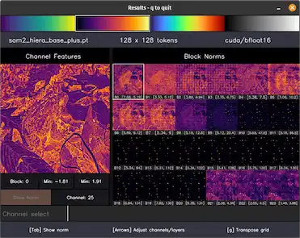
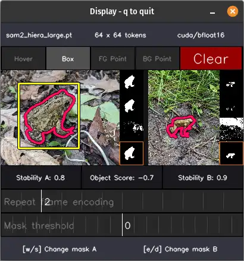
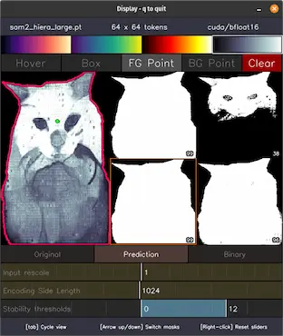
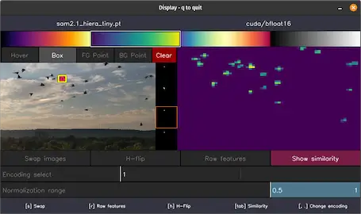
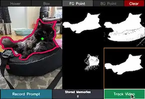
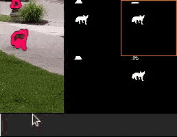
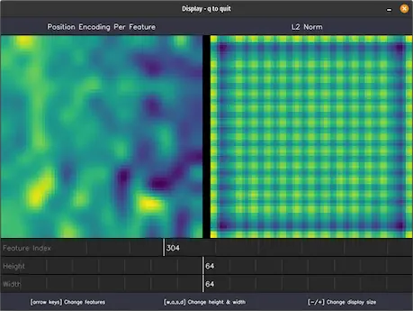
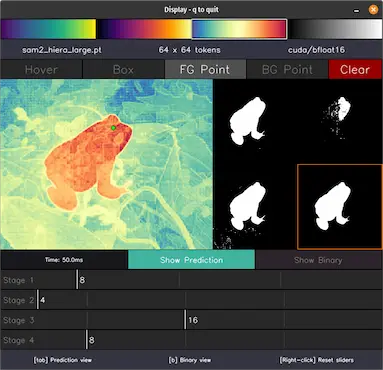
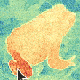

# MuggledSAM - Experiments

This folder contains random experiments using the SAM models, mostly out of curiosity. These scripts have configurable options which can be viewed by running the scripts with the `--help` flag.

## Block Norm Visualization

_(Supports SAMv1, SAMv2, SAMv3)_

This script is a companion to an earlier [block norm visualization](https://github.com/heyoeyo/muggled_dpt/tree/main/experiments#block-norm-visualization) script for depth-prediction models. The display shows the magnitude of the _internal_ image features at every layer of the model, alongside a per-channel visualization of a selected layer. A paper titled [Vision Transformers Need Registers](https://arxiv.org/abs/2309.16588) suggests that vision transformers (like the image encoder inside the SAM models) will end up with unusually high-norm (high magnitude) tokens if they don't include 'registers' (neither version of SAM includes these). This script can help detect these artifacts in the SAM image encoders as well as any fine-tuned variants.

  

Interestingly, while the SAMv2 and SAMv3 models show obvious indications of these high-norm tokens (see the blacked-out tiles in the example image above), the SAMv1 models have high norm values, but _without_ outliers.
Additionally, the tokens for the v1 models show surprisingly little differences from one block to another (vaguely suggesting that the models could make due with far fewer blocks?), while the v2 models show similarly small differences between blocks within each stage, but drastic differences between stages (likely due to pooling).

## Cross-Image Segmentation

_(Supports SAMv2, SAMv3)_

This script is a follow-up to the [image-cross-video](https://github.com/heyoeyo/muggled_sam/tree/main/experiments#video-with-image-priors) segmentation script (inspired by yet another post on the [SAMv2 issues board, #352](https://github.com/facebookresearch/sam2/issues/352)). In this case two regular images are loaded and the user is able to prompt either image while observing the segmentation result on the other! This makes use of the SAMv2/v3 capability for processing videos, with the two images being treated as part of the same video, where the prompted image is the first frame and the other image is the second frame of the video.

  

In the example above, a box prompt on a toad in one image is used to 'automatically' segment a toad from another image, in spite of the fact that the toads, backgrounds and even aspect ratios are different between the two images. One thing that does seem necessary for this to work is to repeatedly encode the 'second' frame, as if it appears several times in a row in the hypothetical 'video' containing both images, this can be done using a slider control in the UI.

There is evidence of 'semantic transfer' capability between images that have similar content, especially when using the large model. However, the results are inconsistent and show high variability from even small changes to the prompt. This hints at an interesting question of whether the model could be trained to be better at this task and whether this might improve the model's semantic understanding of objects, ultimately benefitting regular image/video segmentation.

## Mask Stability Visualization

_(Supports SAMv1, SAMv2, SAMv3)_

This script was made to better understand the 'stability' of SAM masking, after coming across a [stability_score](https://github.com/facebookresearch/segment-anything-2/blob/7e1596c0b6462eb1d1ba7e1492430fed95023598/sam2/utils/amg.py#L158) function in the original SAM implementation. The original scoring function simply calculates the ratio of masked pixels using two different thresholds. The idea being that if the mask doesn't change much as the threshold changes, then the mask can be said to be stable. In this visualization, a lower and upper threshold can be set while the parts of the mask that land within those thresholds is visualized. This can help determine what parts of the mask are most likely to change due to changes in thresholding (and often prompting):

  

In the example above, where the thresholds are set at 0 and +12 (see the bottom-most UI element), bright areas can be considered 'very stable', as the threshold would need to be set above 12 (which is a lot) before those areas would be excluded from the final mask. Darker areas, for example the cat's whiskers, are more likely to be 'lost' as the threshold or prompt changes. It can also be interesting to switch between the different mask outputs as well, as even though the thresholded results may look identical, often the stability is very different.

Out of curiosity, the script also allows for the image encoding size to be changed, as well as even downscaling the input image itself before any processing. This is meant to provide another way of observing how stable the output is in response to slight changes to the input image.

## Semantic Similarity

_(Supports SAMv1, SAMv2, SAMv3)_

This script was made to test an analysis technique described in the [original SAMv1 paper](https://arxiv.org/abs/2304.02643) in the section: **Probing the Latent Space of SAM** (page 22). The goal of this technique is to use the segmentation results of one object to find similar instances of that object automatically in the rest of the image (or other images). This script implements a simplified version of the algorithm with support for having different source & comparison images.

  

The example above shows an image of a flock of pigeons on the left, with one bird masked (via a box prompt) and the corresponding 'similarity image' on the right. The similarity indicates which parts of the image are most similar to the masked bird. In this case it highlights all (21) pigeons while ignoring the sky or darker regions in the rest of the image. It should be noted that this result requires thresholding (controlled by a slider in the UI), and seems to be a best case scenario. Most of the time the similarity mapping is not so clean!

### Details

The algorithm works by trying to match the image tokens associated with a masked object with the tokens from the rest of the image (or even a different image). The basic steps are as follows:
1. Encode an image and generate a mask of an object using SAM
2. Use the generated mask to extract only the encoded image tokens associated with the target object
3. Average the masked image tokens to create a single token representing the object
4. Compute the [cosine similarity](https://en.wikipedia.org/wiki/Cosine_similarity) between the averaged object token and a full image encoding

More details can be found in a [post](https://github.com/facebookresearch/segment-anything/issues/283#issuecomment-1531989328) on the SAMv1 issues board (issue #283). The implementation in this script is slightly different than the original in a few ways:
- The original approach included a sort of 'zoom-in' step, where the masked object is cropped and re-encoded to produce more image tokens. This script does not support this as it would prevent real-time interaction and (from very limited testing) tends to be unhelpful.
- The SAM image encoders include a 'projection' step (a [sequential neck](https://github.com/facebookresearch/segment-anything/blob/dca509fe793f601edb92606367a655c15ac00fdf/segment_anything/modeling/image_encoder.py#L88-L104) module in v1. In v2 it's the [FpnNeck](https://github.com/facebookresearch/sam2/blob/c2ec8e14a185632b0a5d8b161928ceb50197eddc/sam2/modeling/backbones/image_encoder.py#L45). In v3 it comes from the [mask decoder 'convs'](https://github.com/facebookresearch/sam3/blob/757bbb0206a0b68bee81b17d7eb4877177025b2f/sam3/model/necks.py#L13)) which reduces the image tokens to a consistent feature count across all model sizes. The original implementation used the raw features (e.g. prior to the projection step), whereas this script defaults to using the projection features but has a toggle to switch to using the raw features.
- The original implementation included a horizontally flipped copy of the image encoding when performing the averaging step. This script defaults to _not_ using the flipped features, but has a toggle to include them.
- SAMv1 only produces a single set of image tokens. SAMv2 produces 4 sets of raw encodings and 3 projection encodings at different resolutions. SAMv3 similarly produces 3 projection encodings, but only 1 raw encoding. This script provides a slider for switching between the various encodings when a SAMv2 or v3 model is loaded. Only the lowest-resolution encodings tend to be useful.

Overall, this is a relatively simple technique which could also be applied to any other image encoder (assuming an object mask is available). The use of averaging down to a single token has the obvious limitation of mixing together parts of an object which may be visually quite different and ultimately producing a poorer similarity match as a result. Using more than a single averaged token (via clustering of the masked tokens?) to represent the object may improve the results.

It's worth noting that this similarity algorithm is actually very similar to the attention calculation used within transformers, except for the use of cosine similarity in place of a softmax (though cosine similarity is used by some vision transformers, like [Swinv2](https://arxiv.org/abs/2111.09883)). The averaging of the image tokens is analogous to special hard-coding of the (normally learned) weights of an attention block. It's likely that a (very small?) transformer model trained on this semantic-object-matching task could significantly outperform the manually implemented version of the algorithm.

## Video with Image Priors

_(Supports SAMv2, SAMv3)_

This experimental script is a follow-up to a [post on the SAMv2 issues board (#210)](https://github.com/facebookresearch/segment-anything-2/issues/210), where the idea of re-using the SAM video memory bank across videos/images was suggested. This script begins by having the user 'record' prompts from a loaded image and then uses these prompts as the initial memory (with no other prompts) to run segmentation on a separate (potentially unrelated) video:

  
  

Here for example, a single picture of a cat is used to segment a fox from a separate video. Running this experiment with different combinations of image prompts and videos can give some idea of the models' sense of 'similarity' between images.

## ViT Position Encoding Visualization

_(Supports SAMv1, SAMv2, SAMv3)_

This script was made after observing that SAMv1 tends to outperform SAMv2 at image segmentation when working with downscaled or non-square images, figuring that it may have something to do with the positional encodings (in retrospect, the window sizing of v2 is probably the issue). The visualization here is for the encodings that are added to the initial patch embedding tokens to help represent the positioning of each token within the image.

Since they are added to the patch tokens just before the vision transformer, the encodings have a natural 'per-pixel' (or really per-token) format that can be visualized as an image by assigning a color to them based on the relative values of each token/pixel position. The UI includes a slider to adjust which feature 'channel' is being visualized, along with the [L2 norm](https://en.wikipedia.org/wiki/Norm_(mathematics)) (a.k.a the [hypotenuse](https://en.wikipedia.org/wiki/Hypotenuse)) of the encodings is also shown (by default) beside the per-channel visualization. There are also sliders for adjusting the patch sizing.

  

It's interesting to compare the v1 and v2 encodings, as they are dramatically different! For example, SAMv1 has an obvious ordering and structure to the features. There are 4 distinct patterns that are evenly spaced along the channels, which start out as simple low-frequency bars and turn into complicated high-frequency patterns. By comparison, the v2 encodings are made of two parts, a window-tiling component (which can be disabled) and an underlying low-frequency sinuisoidal pattern which doesn't appear to be ordered along channels like the v1 models. Surprisingly, the v2-base model has noticably higher-frequency patterns in it's position encodings compared to all other models. Meanwhile, SAMv3 also uses a tiled encoding, like v2, but doesn't have any other underlying components, so it's fairly boring looking.

It's worth noting that the default [bfloat16](https://pytorch.org/docs/stable/tensor_attributes.html#torch-dtype) data type seems to corrupt the SAMv1 encodings to some extent, though it doesn't affect segmentation performance (...not sure why?). Switching to float32 (using the `-f32` flag when running the script) avoids this distortion.

## Window Size Visualization

_(Supports SAMv1, SAMv2, SAMv3)_

This script was inspired by a [pull request](https://github.com/facebookresearch/segment-anything/pull/594) for the SAMv1 model which suggested some improvements when using a window size of 16 (which evenly 'tiles' into the default 64x64 patch sizing) instead of the base size of 14. SAMv2 has a far more complex use of windowing which varies by stage in a somewhat unpredictable pattern, leading to even more questions about the consequences of changing the window sizing.

  

The UI allows for independently updating the window size of each stage while watching what happens to the raw mask predictions (i.e. without thresholding) of the model for a given prompt. It's also possible to change the prompt as this is happening.

  

One interesting observation from playing with this script is that adjustments to stages 1, 2 & 3 of SAMv2 show consistent but distinct effects. For example, changes to stage 1 tend to shuffle around small artifacts, increasing sizing on stage 2 has a blurring effect while decreasing sizing on stage 3 destabilizes the masking entirely. By comparison, while SAMv1 is affected by changes to window sizing on any stage, it tends to be less consistent and less detrimental. As the original (SAMv1) pull request suggested, increasing the window size to 16 actually _speeds up_ the model slightly (this is true for v2 as well) without dramatically harming the masking results (not true for v2!). The newer SAMv3 uses a window size of 24 which _does_ evenly tile into the default 72x72 patch sizing, so there is no clear benefit to changing the sizing.