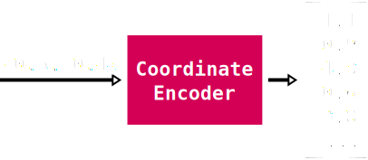
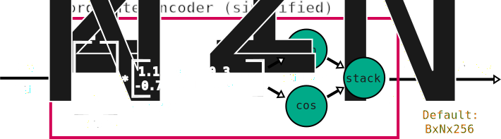
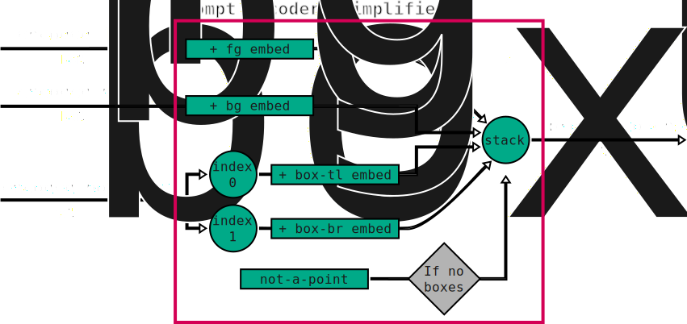
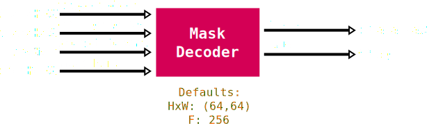

# SAMv1

The Segment-Anything models (SAM) are a more intelligent version of the [magic wand tool](https://www.gifgit.com/image/magic-wand-tool) commonly found in most [image editors](https://krita.org/en/). The model takes an image as an input and produces segmentation masks based on prompts provided as either points or bounding boxes.

  

One notable feature of the SAM models is that they are not trained to recognize specific object classes. In fact they have no support for classification whatsoever! However, since they are not limited to reporting known classes, they are in some ways able to segment 'anything' and seem to generalize to uncommon shapes or structures fairly well.

A second important feature is that the models always produce four candidate segmentation masks. This is done to help deal with the inherent ambiguity of trying to segment an image based on one (or few) prompt points. The image below shows an example of the four masks for a single point prompt, which segment the eye, head or full body of a turtle, all of which could be considered valid given the point prompt:

  

The model consists of 4 major components: an image encoder, a coordinate encoder, a prompt encoder and a mask decoder. The diagram below shows how data flows through the different components, with optional elements left out for clarity:

  

This description is slightly different from the [original implementation](https://github.com/facebookresearch/segment-anything?tab=readme-ov-file#segment-anything) (for example, the coordinate encoder is [part of the prompt encoder](https://github.com/facebookresearch/segment-anything/blob/dca509fe793f601edb92606367a655c15ac00fdf/segment_anything/modeling/prompt_encoder.py#L43) originally), but is functionally equivalent. Each of the major components is described in more detail below.

## Image encoder

The image encoder is responsible for converting RGB image data into a more computationally useful format, often referred to as 'image tokens' or 'image features'. These image tokens are very similiar, conceptually, to 'pixels' except that instead of representing a single feature (e.g. color), they're meant to represent higher-level concepts. For example, the tokens may encode how animal-like a region is, or what the dominate texture in the region might be, or whether the region is mostly foreground or background etc. Though it's worth noting that this encoding is _learned_ through training so these concepts are not decided (and often not easily understood) by humans, but instead by patterns in the training data.

  

The image encoder in SAM is itself composed of 4 major parts: a patch embedding model, a position encoder, a vision transformer and a channel projection model.

### Patch embedding model

The patch embedding model performs two important functions. First, it groups together regions of the original image (a.k.a. patches) into single point-like representations. Secondly, the model maps each point-like representation to a high dimensional representation space. Taking low-dimensional data and mapping into a higher dimensional space is sometimes referred to as 'embedding', so the term 'patch embedding' is quite literal. The image below shows an example set of (8x8) regions/patches across an image.

Both the grouping and mapping to high dimensions is done in a single operation called a (strided) [2D convolution](https://pytorch.org/docs/stable/generated/torch.nn.Conv2d.html). Despite the name, convolution is a [fairly intuitive operation](https://github.com/vdumoulin/conv_arithmetic/blob/master/README.md) involving a repeated dot product calculation between a fixed set of values (called a 'kernel') and small (16x16 for SAMv1) regions of some other input data, in this case the original RGB image. The result of each dot product is then stored in a spatial arrangment matching the positioning of the region that was used, producing another image. Confusingly, although the operation is called '2D' convolution, the dot product that is performed involves not only small 2D regions but also all values along all channels of those regions! So the computation really involves 3D blocks of data, but the regions are selected by moving the kernel around in 2D only.

It's standard practice to consider all possible regions of the image when performing a 2D convolution, however for patch embedding the convolution is **strided**. This just means that the regions are spaced out, and in this case, the spacing matches the size of the region. This results in the regions having no overlap with one another and so the convolution can alternatively be thought of as dicing up the input image and computing a weighted sum of each diced up piece. This also means that the convolution has the effect of producing a much lower resolution result compared to the input image (e.g. there are far fewer diced regions than there are pixels).

To create a high dimensional representation, many independent convolution kernels (i.e. weightings) are used and the results are stacked together as multiple _channels_, similar to how the input image will itself have 3 (RGB) channels. The number of channels varies by model size, but it can be in the hundreds or even over a thousand! For example, the smallest SAMv1 model uses 16x16 sized kernels and there are 768 of them! The result is that the patch embedding model takes in (by default) 1024x1024 images with 3 channels (RGB) and produces a 64x64 result with 768 channels. Each of the 768-channel 'pixels' in this result is called a 'token', so we could alternatively say that the patch embedding produces 4096 (=64*64) tokens representing the input image.

For the sake of analogy, the patch embedding model is equivalent to a [tokenizer](https://platform.openai.com/tokenizer) in the context of [LLMs](https://en.wikipedia.org/wiki/Large_language_model), which converts 'patches' of words into high-dimensional numerical representations (tokens) for further processing.

### Position Encoder

Position encoding is a standard but somewhat odd requirement for building well performing transformer-based models. It's used to provide positioning information about each of the image tokens from the patch embedding model, for example, to encode the fact that the top-left most token is actually in the top-left. This sort of information may seem unnecessary as it is already represented by the grid-like shaping of the tokens (e.g. the 64x64 arrangement), however vision transformers do not make use of this structural information and so the positioning must be 'baked into' the tokens themselves.

There are a wide range of approaches to handling position encoding, however SAMv1 uses an extremely simple approach of learning a fixed set of values which are simply **added** to the tokens to encode positioning information. One of the downsides of this approach is that these values are learned at a single resolution. In the case of SAMv1, the encodings are learned at a 64x64 resolution, matching the default patch embedding sizing. This can limit the ability of the model to be adapted to smaller or larger input sizings, though it's common to use interpolation to upscale or downscale these learned offsets to adapt to other input sizes. This repo supports scaling of the position encodings, including to non-square sizes, and fortunately the model tolerates this fairly well.

One interesting note here is that while the position encodings are learned, it's clear that the authors of SAMv1 did not initialize these offsets randomly. It seems they began with high frequency sinusoids (spatially, across the 64x64 grid) that decrease in frequency across the encoding channels until turning to noise-like patterns. There are also 4 distinct 'starting sinusoids' (horizontal-sine, horizontal-cosine, vertical-sine, vertical-cosine) that are spread out evenly across the channels of the position encoding.

  

The image above shows several channels from the learned position encodings (colormapped for visualization) of the SAMv1 vit-b model. The left-most column shows the 4 distinct starting sinusoids which occur at channels: 0, 192, 384, 576 respectively while the rows show encodings (roughly) 64 channels apart from the left-most channel (e.g top row is 0, 64, 127, 191). These patterns can be visualized using one of the [experimental scripts](https://github.com/heyoeyo/muggled_sam/tree/main/experiments#vit-position-encoding-visualization) in this repo.

### Vision transformer

The vision transformer (ViT) makes up the bulk of the image encoder, and in fact, the bulk of the SAM model itself! It's purpose could be described as 'token enrichment'. It serves to make the image tokens (from the patch embedding step) more useful or meaningful for the eventual use in segmentation masking. The term 'ViT' seems to come from the paper "[An Image is Worth 16x16 Words](https://arxiv.org/abs/2010.11929)" which popularized the idea of using transformer blocks on image tasks. For clarity, the term ViT is used here to refer to the model consisting only of transformer blocks, whereas in the original paper, the term refers to a model also containing the patch embedding and position encoding steps (called the 'image encoder' in this repo).

SAMv1 uses a model called ViTDet, coming from the paper: "[Exploring Plain Vision Transformer Backbones for Object Detection](https://arxiv.org/abs/2203.16527)". This model has 3 notable differences compared to the original ViT implementation:

1. It consists of 4 equally sized stages. Each stage is just a sequence of transformer blocks.
2. It makes use of windowed-attention on all but the last-most block of each stage which uses regular ('global') attention
3. It uses (fairly complicated!) additive relative position encoding within every attention block

Although the model has 4 stages, they are not used in a typical 'hierarchical' way. For example, the stages don't generate separate outputs and they don't operate at different resolutions. Instead the stages simply mark the use of global attention blocks.

The use of windowed attention blocks causes very subtle artifacts (see the [window sizing experiment](https://github.com/heyoeyo/muggled_sam/tree/main/experiments#window-size-visualization) script) in the model output and likely degrades the model's accuracy. However, they also reduce the total amount of computation as well as the memory requirements of the model, so are likely a reasonable tradeoff of accuracy/performance. The use of several global attention blocks is meant to mix information around the entire image and is a clever alternative to more complex techniques like shifting the windows (like in [Swin](https://arxiv.org/abs/2103.14030) models).

The per-block relative position encoding is by far the most complex part of the vision transformer. The effect is to modify the original attention calculation, from "[Attention Is All You Need](https://arxiv.org/abs/1706.03762)", to something like:

$$\text{Attention}(Q, K, V) = \text{SoftMax} \left (\frac{QK^T}{\sqrt{d_{k}}} + P \right ) \times V$$

$$\text{(where P is the additive relative positional encoding term)}$$

This modification is straightforward in theory, but the implementation is far from simple and also prevents the use of more optimized implementations of the attention calculation, and has much higher VRAM requirements as a consequence.

### Channel projection model

The channel projection model is a very simple sequence of convolutions which are used to reduce the channel count of the image tokens from the ViT model to a standardized value across all model sizes. For example, the image token channel count of the smallest (vit-b) SAMv1 model is 768, while the largest (vit-h) has 1280 channels, but in both cases the channel projection model reduces this to 256.

It's worth noting that the projection happens on the very first 1x1 convolution. The following 3x3 convolution can be thought of as spatially 'mixing around' the channel information (it seems like an odd detail!).

## Coordinate Encoder

The coordinate encoder is a somewhat unusual model component. It takes in (x,y) coordinate pairs (between 0 and 1) and produces a single high-dimensional vector per coordinate pair. This encoder is used to process all prompt inputs, so for example all foreground points, background points as well as bounding-box corner points are converted to vectors/embeddings using this model.

  

The encoding process itself is interesting and seems to make use of the results from a paper titled: "[Fourier Features Let Networks Learn High Frequency Functions in Low Dimensional Domains](https://arxiv.org/abs/2006.10739)" (math heavy!). In this paper, the authors suggest that using a standard [MLP](https://en.wikipedia.org/wiki/Multilayer_perceptron) to directly encode xy coordinates will tend to fail for representing higher frequency information. Instead they suggest that applying the following transformation prior to using an MLP works better:

$$\vec{XY Encoding} = \left [\sin{(2 \pi \vec{f}^T \vec{p})}, \space \cos{(2 \pi \vec{f}^T \vec{p})} \right ] \space \text{where} \space \vec{p} = \left [ x, y \right ] $$

Here `p` is the xy position being encoded while `f` is called a 'frequency vector'. This frequency vector `f` (really a matrix with 2 rows) is, surprisingly, made of randomly sampled values from a gaussian distribution! According to the referenced paper this formulation: "dramatically improves the performance of coordinate-based MLPs". This approach of using sinusoidal mappings is similar to the position encodings in the original "[Attention Is All You Need](https://arxiv.org/abs/1706.03762)" paper, though it's argued that the original approach produces biased results that don't work as well as the randomly sampled frequency approach used here. The coordinate encoder within the SAM model implements this mapping without any follow-up MLP:

  

Perhaps most interestingly, this same encoder is also used to produce position encodings for the image tokens output by the image encoder. These are intended for use in the mask decoder and are separate from the encodings used within the image encoder itself. The encodings are generated by considering the xy coordinates associated with each 'grid position' of the image tokens, and then encoding each of these xy coordinates. In total, the coordinate encoder is used to (independently) encode grid positions, foreground points, background points, top-left bounding box points and bottom-right bounding-box points:

  

## Prompt Encoder

The purpose of the prompt encoder is to encode the 'meaning' associated with different types of (encoded) coordinates and to combine all encoded points into a single set of tokens for use in the mask decoder.

  

The prompt encoder is extremely simple, consisting of only additive learned embeddings. There are a total of 5 embeddings:

1. Foreground (FG) point
2. Background (BG) point
3. Bounding-box top-left point
4. Bounding-box bottom-right point
5. Not a point (a.k.a. padding point)

These embeddings are simply added to the tokens produced by the coordinate encoder in order to 'tell the model' the meaning of each coordinate. These additive values are the _only reason_ the model responds differently to foreground vs. background prompts, or why the model doesn't interpret bounding box corners as foreground prompts, for example.

  

The prompt encoder can also pad prompts using a special 'not a point' embedding. This is likely included to help with training the model, since it can be used to pad smaller prompts to match the shape of larger prompts for the sake of batching together inputs during training. Outside of training, including padding points seems to have a small but beneficial impact, for example the original implementation [includes padding](https://github.com/facebookresearch/segment-anything/blob/dca509fe793f601edb92606367a655c15ac00fdf/segment_anything/modeling/prompt_encoder.py#L155) when using point prompts, as long as a box prompt isn't also provided (this is replicated in this repo as well).

## Mask Decoder

The mask decoder model is responsible for generating the main output of the SAM models, that is, segmentation masks along with predictions of how good those masks are (the IoU scores).

  

The mask decoder model is designed to be relatively fast (compared to the image encoder at least), in order to provide 'real-time' interaction speeds when generating segmentation masks. For example, this design allows for interactive feedback as the user modifies their input prompt. In spite of it's speed, it is composed of many parts and is arguably the most structurally complex piece of the SAM model.

  

The heart of the decoder is a 'cross attention' transformer model. This model, as the name suggests, performs cross-attention (see "[Attention Is All You Need](https://arxiv.org/abs/1706.03762)") between the image tokens and the prompt tokens. The prompt tokens themselves are stacked together with a set of learned tokens, used to encode information about the final output masks and [intersection-over-union](https://en.wikipedia.org/wiki/Jaccard_index) (IoU) scores. The cross-attention transformer is described in the [components section](https://github.com/heyoeyo/muggled_sam/tree/main/lib/v1_sam/components), while the (smaller) sub-components are described below:

### Mask Hint Encoder

The mask hint encoder is not part of the original model design. Instead, the original implementation considers masks to be a type of prompt input and so this functionality was [part of the prompt encoder](https://github.com/facebookresearch/segment-anything/blob/dca509fe793f601edb92606367a655c15ac00fdf/segment_anything/modeling/prompt_encoder.py#L161-L166). However, in practice, masks do not seem to work well as prompts, and seem to require very special formatting to work at all in many cases. The original paper explains that mask inputs were used as part of the training process, where masks output from the model were used to augment inputs for repeat prompting, suggesting that these masks are meant to act more like modifiers to help other prompts, hence the name 'mask hint' here.

### Mask Generator

In the original SAM implementation, the mask generator is [built into the mask decoder model](https://github.com/facebookresearch/segment-anything/blob/dca509fe793f601edb92606367a655c15ac00fdf/segment_anything/modeling/mask_decoder.py#L136-L144). Here it is separated for readability. The mask generator performs two major functions, first, it upscales the image tokens to a larger resolution (while reducing the channel count!) and secondly it performs a dot product between the image tokens and the (encoded) mask tokens to produce the final mask outputs.

### IoU MLP

The purpose of the IoU MLP is to convert the single encoded IoU token (from the cross-attention transformer) into 4 values, one for each of the output mask predictions. These numbers are meant to be predictions of the IoU between each of the predicted masks and a hypothetical (unknown) ground-truth mask.

Ideally SAM would always produce masks with IoUs of 100% with their ground-truths. However, in practice this isn't always possible, so this model provides as a way of gauging the 'confidence' of the mask outputs. High IoU scores indicate that the model 'thinks' the corresponding mask prediction closely overlaps with the (unknown) ground-truth, while lower scores suggest the predicted masks may not be very accurate. These scores can be used to automatically select the 'best' mask in cases where user choice isn't available. Although in some cases, [mask stability](https://github.com/heyoeyo/muggled_sam/tree/main/experiments#mask-stability-visualization) may be a better predictor of the mask quality.

