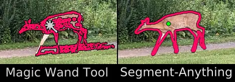
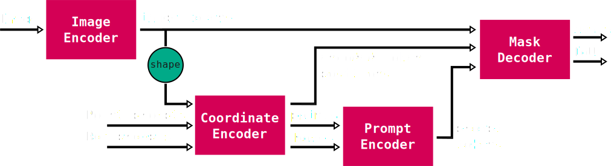

# SAMv1

The Segment-Anything models (SAM) are a more intelligent version of the [magic wand tool](https://www.gifgit.com/image/magic-wand-tool) commonly found in most [image editors](https://krita.org/en/). The model takes an image as an input and produces segmentation masks based on prompts provided as either points or bounding boxes.

  

One notable feature of the SAM models is that they are not trained to recognize specific object classes. In fact they have no support for classification whatsoever! However, since they are not limited to reporting known classes, they are in some ways able to segment 'anything' and seem to generalize to uncommon shapes or structures fairly well.

A second important feature is that the models always produce four candidate segmentation masks. This is done to help deal with the inherent ambiguity of trying to segment an image based on one (or few) prompt points. The image below shows an example of the four masks for a single point prompt, which segment the eye, head or full body of a turtle, all of which could be considered valid given the point prompt:

  

The model consists of 4 major components: an image encoder, a coordinate encoder, a prompt encoder and a mask decoder. The diagram below shows how data flows through the different components, with optional elements left out for clarity:

  

This description is slightly different from the [original implementation](https://github.com/facebookresearch/segment-anything?tab=readme-ov-file#segment-anything) (for example, the coordinate encoder is [part of the prompt encoder](https://github.com/facebookresearch/segment-anything/blob/dca509fe793f601edb92606367a655c15ac00fdf/segment_anything/modeling/prompt_encoder.py#L43) originally), but is functionally equivalent.

Each of the major components will be described in more detail eventually (WIP).
