# SAMv1

The Segment-Anything models (SAM) are a more intelligent version of the [magic wand tool](https://www.gifgit.com/image/magic-wand-tool) commonly found in most [image editors](https://krita.org/en/). The model takes an image as an input and produces segmentation masks based on prompts provided as either points or bounding boxes. There are 3 different model sizes ([base, large and huge](https://github.com/facebookresearch/segment-anything?tab=readme-ov-file#model-checkpoints)) that were released in 2023 with the paper: "[Segment Anything](https://arxiv.org/abs/2304.02643)".

  

One notable feature of the SAM models is that they are not trained to recognize specific object classes. In fact they have no support for classification whatsoever! However, since they are not limited to reporting known classes, they are in some ways able to segment 'anything' and seem to generalize to uncommon shapes or structures fairly well. The models are also designed to deal with the inherent ambiguity of trying to segment shapes based on one (or few) prompt points. They do this by _always_ generating four candidate segmentation masks. The image below shows an example of the four masks for a single point prompt, which segment the eye, head or full body of a turtle, all of which could be considered valid given the point prompt:

  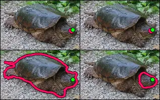

Structurally, the model consists of 4 major components: an image encoder, a coordinate encoder, a prompt encoder and a mask decoder. The image encoder is relatively heavy/slow, but only needs to run once per image. All of the other components are designed to be fast enough to run in less than 50ms on CPU, so that prompting can be done interactively. The diagram below shows how data flows through the different components, with some optional elements left out for clarity:

  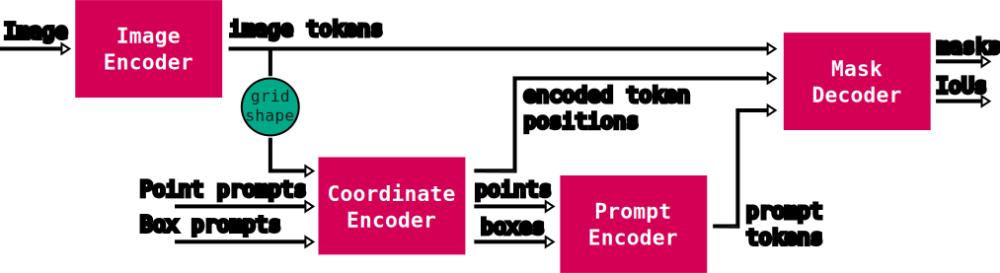

This structure is slightly different from the [original implementation](https://github.com/facebookresearch/segment-anything?tab=readme-ov-file#segment-anything) (for example, the coordinate encoder is [part of the prompt encoder](https://github.com/facebookresearch/segment-anything/blob/dca509fe793f601edb92606367a655c15ac00fdf/segment_anything/modeling/prompt_encoder.py#L43) originally), but is functionally equivalent. Each of the major components is described in more detail below.

## Image encoder

The image encoder is responsible for converting RGB image data into a more computationally useful format, often referred to as 'image tokens' or 'image features'. These image tokens are very similiar, conceptually, to 'pixels' except that instead of representing a single feature (e.g. color), they're meant to represent higher-level concepts. For example, the tokens may encode how animal-like a region is, or what the dominate texture in the region might be, or whether the region is mostly foreground or background etc. Though it's worth noting that this encoding is _learned_ through training so these concepts are not decided (and often not easily understood) by humans, but instead by patterns in the training data.

  

The image encoder in SAM is itself composed of 4 major parts: a patch embedding model, a position encoder, a vision transformer and a channel projection model.

  

### Patch embedding model

The patch embedding model performs two important functions. First, it breaks apart the original image into separate non-overlapping regions or 'patches'. Secondly, it maps each patch to a high dimensional point-like representation. Taking low-dimensional data and mapping into a higher dimensional space is sometimes referred to as 'embedding', so the term 'patch embedding' is quite literal.

Both the grouping and mapping to high dimensions is done in a single operation called a (strided) [2D convolution](https://pytorch.org/docs/stable/generated/torch.nn.Conv2d.html). Despite the name, convolution is a [fairly intuitive operation](https://github.com/vdumoulin/conv_arithmetic/blob/master/README.md) involving a repeated [dot product](https://en.wikipedia.org/wiki/Dot_product) calculation between a fixed set of values (called a 'kernel') and small (16x16 for SAMv1) regions of some other input data, in this case the original RGB image. The convolution used in patch embedding is also **strided** which means that the regions involved are spaced apart. For patch embedding, the spacing is equal the region sizes themselves, which leads to the separate non-overlapping 'patches'. The net effect is that patch embedding can be thought of as dicing up the input image and computing a weighted sum of each diced up piece. This also means that the convolution has the effect of producing a much lower resolution result compared to the input image (e.g. there are far fewer diced regions than there are pixels).

  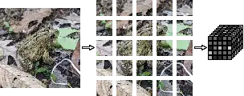

To create a high dimensional representation, many independent convolution kernels (i.e. weightings) are used and the results are stacked together as multiple _channels_, similar to how the input image will itself have 3 (RGB) channels. The number of channels (also called 'features') varies by model size, but the smallest SAMv1 model has 768 of them. This value is likely chosen to help preserve the information in the input data, which is a 16x16 patch with 3 color channels, and therefore there are `16*16*3 = 768` unique input values to be encoded.

The end result is that the patch embedding model takes in (by default) 1024x1024 images with 3 channels (RGB) and produces a 64x64 result with 768 channels. Each of the 768-channel 'pixels' in this result is called a 'token', so we could alternatively say that the patch embedding produces 4096 (=64*64) tokens representing the input image. The image below shows how a single patch is converted into a single token through dot products with multiple kernels (acting on the RGB values) which each produce a single number from the given patch.

  

For the sake of analogy, the patch embedding model is equivalent to a [tokenizer](https://platform.openai.com/tokenizer) in the context of [LLMs](https://en.wikipedia.org/wiki/Large_language_model), which converts 'patches' of words into high-dimensional numerical representations (tokens) for further processing. In this context an image can be thought of as a _sentence_ with the different regions of the image being the words. The original [DALL-E](https://en.wikipedia.org/wiki/DALL-E) text-to-image model was based on this idea, where the model would 'answer' a text prompt with a sequence of tokens (like a normal LLM), but these tokens were converted to pixel data instead of text in order to produce images!

### Position encoder model

Position encoding is a standard but somewhat odd requirement for building well performing transformer-based models. It's used to provide positioning information about each of the image tokens from the patch embedding model, for example, to encode the fact that the top-left most token is actually in the top-left. This sort of information may seem unnecessary as it is already represented by the grid-like shaping of the tokens (e.g. the 64x64 arrangement), however vision transformers do not make use of this structural information and so the positioning must be 'baked into' the tokens themselves.

There are a wide range of approaches to handling position encoding, however SAMv1 uses an extremely simple approach of learning a fixed set of values which are simply **added** to the tokens to encode positioning information. One of the downsides of this approach is that these values are learned at a single resolution. In the case of SAMv1, the encodings are learned at a 64x64 resolution, matching the default patch embedding size when using 1024x1024px inputs. This can limit the ability of the model to be adapted to smaller or larger input sizings, though it's common to use interpolation to resize the learned offsets to match other input sizes as needed. This repo supports scaling of the position encodings, including to non-square sizes, and fortunately the model tolerates this fairly well.

  

One interesting note here is that while the position encodings are learned, it's clear that the authors of SAMv1 did not initialize these offsets randomly. It seems they began with high frequency sinusoids (spatially, across the 64x64 grid) that decrease in frequency across the encoding channels until turning to noise-like patterns. There are also 4 distinct 'starting sinusoids' (horizontal-sine, horizontal-cosine, vertical-sine, vertical-cosine) that are spread out evenly across the channels of the position encoding. Strangely, the cosine starting patterns change frequency (across channels) more quickly than the sine patterns.

  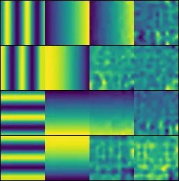

The image above shows several channels from the learned position encodings (colormapped for visualization) of the SAMv1 vit-b model. The left-most column shows the 4 distinct starting sinusoids which occur at channels: 0, 192, 384, 576 respectively while the rows show encodings (roughly) 64 channels apart from the left-most channel (e.g top row is 0, 64, 127, 191). These patterns can be visualized using one of the [experimental scripts](https://github.com/heyoeyo/muggled_sam/tree/main/experiments#vit-position-encoding-visualization) in this repo.

### Vision transformer

The vision transformer (ViT) makes up the bulk of the image encoder, and in fact, the bulk of the SAM model itself! It's purpose could be described as 'token enrichment'. It serves to make the image tokens (from the patch embedding step) more useful or meaningful for the eventual use in segmentation masking. The term 'ViT' seems to come from the paper "[An Image is Worth 16x16 Words](https://arxiv.org/abs/2010.11929)" which popularized the idea of using transformers on image tasks. The transformer structure and use of attention blocks was itself popularized in the paper: "[Attention Is All You Need](https://arxiv.org/abs/1706.03762)" and more information about it's operation can be found in [The Illustrated Transformer](https://jalammar.github.io/illustrated-transformer/) by Jay Alamar.  For clarity, the term ViT is used here to refer to the model consisting only of attention blocks, whereas in the original ViT paper, the term refers to a model also containing the patch embedding and position encoding steps (called the 'image encoder' in this repo).

SAMv1 uses a model called ViTDet, coming from the paper: "[Exploring Plain Vision Transformer Backbones for Object Detection](https://arxiv.org/abs/2203.16527)". This model has 3 notable differences compared to the original ViT implementation:

1. It consists of 4 equally sized stages. Each stage is just a sequence of attention blocks.
2. It makes use of windowed-attention on all but the last-most block of each stage which uses regular ('global') attention
3. It uses (fairly complicated!) additive relative position encoding within every attention block

  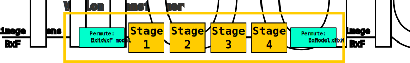

Although the model has 4 stages, they are not used in a typical 'hierarchical' way. For example, the stages don't generate separate outputs and they don't operate at different resolutions. Instead the stages simply mark the use of global attention blocks. The number of blocks per stage is 3, 6 or 8, depending on the model size. It's worth noting that the original implementation does not explicitly indicate the 4 stages instead it's structured as a [single sequence of blocks](https://github.com/facebookresearch/segment-anything/blob/dca509fe793f601edb92606367a655c15ac00fdf/segment_anything/modeling/image_encoder.py#L111-L112) (with [some logic](https://github.com/facebookresearch/segment-anything/blob/dca509fe793f601edb92606367a655c15ac00fdf/segment_anything/modeling/image_encoder.py#L83) to toggle global attention on different blocks).

  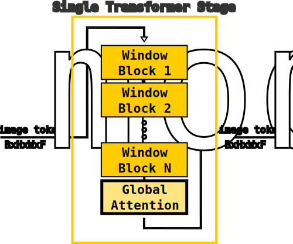

The input and output of every block (of every stage) is of the same 'type' of data: _encoded image tokens_. The only difference between blocks is the progression of the encoding (i.e. the output of the last-most stage is a 'completely' encoded set of tokens). Since the block outputs represent the same sort of information, and that information is inherently image-like, it's possible to visualize using the [block norm visualization](https://github.com/heyoeyo/muggled_sam/tree/main/experiments#block-norm-visualization) experimental script.

Windowed attention is an optimization technique, where each image token only 'attends' to a limited set of other image tokens that are spatially nearby, rather than attending to all image tokens as in regular or 'global' attention. To avoid processing happening exclusively in localized regions (the windows), global attention is included at the end of each stage to help mix information around the entire image. This is a simple alternative to more complex techniques like shifting the windows (e.g. in [Swin](https://arxiv.org/abs/2103.14030) models).

  

  

As the diagram above shows, the only difference between the windowed and global attention blocks is the windowing and un-windowing steps, all other components are identical. The attention calculation makes use of very complicated additive relative positional encodings. This position encoding is implemented differently than the prior [position encoder](#position-encoder-model) and is arguably the most complex part of the vision transformer. The effect is to modify the original attention calculation, from "[Attention Is All You Need](https://arxiv.org/abs/1706.03762)", to something like:

$$\text{Attention}(Q, K, V) = \text{SoftMax} \left (\frac{QK^T}{\sqrt{d_{k}}} + P \right ) \times V$$

$$\text{(where P is the additive relative positional encoding term)}$$

This modification is straightforward in theory, but it prevents the use of more optimized implementations of the attention calculation and has much higher VRAM requirements as a consequence. Details about the attention implementation can be found in the model [components section](https://github.com/heyoeyo/muggled_sam/tree/main/muggled_sam/v1_sam/components).

### Channel projection model

The channel projection model is a very simple sequence of convolutions, without activation functions. The model is used to reduce the channel count of the image tokens from the ViT model to a standardized value across all model sizes. For example, the image token channel count of the smallest (vit-b) SAMv1 model is 768, while the largest (vit-h) has 1280 channels, but in both cases the channel projection model reduces this to 256.

  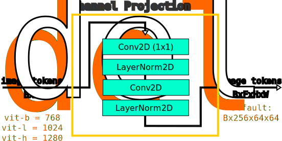

It's worth noting that the projection happens on the very first 1x1 convolution. The following convolution (3x3) can be thought of as spatially 'mixing around' the channel information (it seems like an odd detail!).

## Coordinate Encoder

The coordinate encoder is a somewhat unusual model component. It's a position encoder, but different from the other two found in the image encoder. It takes in (x,y) coordinate pairs (between 0 and 1) and produces a single high-dimensional vector per coordinate pair. This encoder is used to process all prompt inputs, so for example all foreground points, background points as well as bounding-box corner points are converted to vectors/embeddings using this model.

  

The encoding process itself is interesting and seems to make use of the results from a paper titled: "[Fourier Features Let Networks Learn High Frequency Functions in Low Dimensional Domains](https://arxiv.org/abs/2006.10739)" (math heavy!). In this paper, the authors suggest that using a standard [MLP](https://en.wikipedia.org/wiki/Multilayer_perceptron) to directly encode xy coordinates will tend to fail for representing higher frequency information. Instead they suggest that applying the following transformation prior to using an MLP works better:

$$\vec{XY Encoding} = \left [\sin{(2 \pi \vec{f^T} \vec{p})}, \space \cos{(2 \pi \vec{f^T} \vec{p})} \right ] \space \text{where} \space \vec{p} = \left [ x, y \right ] $$

Here `p` is the xy position being encoded while `f` is called a 'frequency vector'. This frequency vector `f` (really a matrix with 2 rows) is, surprisingly, made of randomly sampled values from a gaussian distribution! According to the referenced paper this formulation: "dramatically improves the performance of coordinate-based MLPs". This approach of using sinusoidal mappings is similar to the position encodings in the original "[Attention Is All You Need](https://arxiv.org/abs/1706.03762)" paper, though it's argued that the original approach produces biased results that don't work as well as the randomly sampled frequency approach used here. The coordinate encoder within the SAM model implements this mapping without any follow-up MLP:

  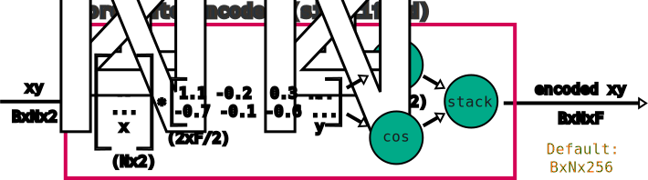

Perhaps most interestingly, this same encoder is also used to produce position encodings for the image tokens output by the image encoder. These are intended for use in the mask decoder and are separate (not clear why?) from the encodings used within the image encoder itself. The encodings are generated by considering the xy coordinates associated with each 'grid position' of the image tokens, and then encoding each of these xy coordinates. In total, the coordinate encoder is used to (independently) encode grid positions, foreground points, background points, top-left bounding box points and bottom-right bounding-box points:

  

## Prompt Encoder

The purpose of the prompt encoder is to encode the 'meaning' associated with different types of (encoded) coordinates and to combine all encoded points into a single set of tokens for use in the mask decoder. Note that in the original model, the prompt encoder also supported mask inputs as a type of prompt, which is instead [part of the mask decoder](#mask-hint-encoder) in this repo.

  

The prompt encoder is extremely simple, consisting of only 5 additive learned embeddings:

1. Foreground (FG) point
2. Background (BG) point
3. Bounding-box top-left (TL) point
4. Bounding-box bottom-right (BR) point
5. Not a point (a.k.a. padding point)

These embeddings are simply added to the tokens produced by the coordinate encoder in order to 'tell the model' the meaning of each coordinate. These additive values are the _only reason_ the model responds differently to foreground vs. background prompts, or why the model doesn't interpret bounding box corners as foreground prompts, for example.

  

The prompt encoder can also pad prompts using a special 'not a point' embedding. This is likely included to help with training the model, since it can be used to pad smaller prompts to match the shape of larger prompts for the sake of batching together inputs during training. Outside of training, including padding points seems to have a small but beneficial impact, for example the original implementation [includes padding](https://github.com/facebookresearch/segment-anything/blob/dca509fe793f601edb92606367a655c15ac00fdf/segment_anything/modeling/prompt_encoder.py#L155) when using point prompts, as long as a box prompt isn't also provided (this is replicated in this repo as well).

## Mask Decoder

The mask decoder model is responsible for generating the main output of the SAM models, that is, segmentation masks along with predictions of how good those masks are (the IoU scores).

  

The mask decoder model is designed to be relatively fast (compared to the image encoder at least), in order to provide 'real-time' interaction speeds when generating segmentation masks. For example, this design allows for interactive feedback as the user modifies their input prompt. In spite of it's speed, it is composed of many parts and is arguably the most structurally complex piece of the SAM model.

  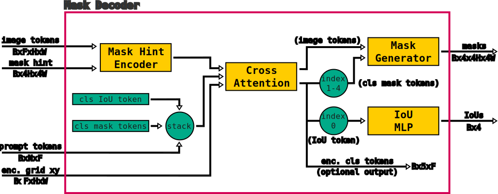

The heart of the decoder is a 'cross attention' transformer model. This model, as the name suggests, performs cross-attention (see "[Attention Is All You Need](https://arxiv.org/abs/1706.03762)") between the image tokens and the prompt tokens. The prompt tokens themselves are stacked together with a set of learned tokens, used to encode information about the final output masks and [intersection-over-union](https://en.wikipedia.org/wiki/Jaccard_index) (IoU) scores. The cross-attention transformer is described in the [components section](https://github.com/heyoeyo/muggled_sam/tree/main/muggled_sam/v1_sam/components), while the (smaller) sub-components are described below:

### Mask Hint Encoder

The mask hint encoder is not a standalone component in the original model design, instead, masks were considered to be a type of prompt input so this functionality was [part of the prompt encoder](https://github.com/facebookresearch/segment-anything/blob/dca509fe793f601edb92606367a655c15ac00fdf/segment_anything/modeling/prompt_encoder.py#L161-L166). However, in practice, masks do not seem to work as prompts, instead they are more useful when augmenting other prompts (even then, they perform poorly), hence the use of the term 'hint' here. They also involve completely different processing compared to the other prompts, which is why it's been moved to its own model in this repo. The [original paper](https://arxiv.org/abs/2304.02643) explains that mask inputs were used as part of the training process, where masks output from the SAM model were used to augment inputs for repeat prompting (see section **Training algorithm** on page 17). This may explain why input masks don't work well on their own.

  

The purpose of this encoder is to create an embedding which is directly added to the image tokens. However if a mask hint is not given, then the encoder will repeat/tile a single learned 'no mask' embedding to match the height & width of the image tokens. When a mask _is_ given, it's downscaled by a factor of 4, while also having feature channels added in order to match the image token feature count. The downscaler consists of a sequence of strided [2D convolutions](https://pytorch.org/docs/stable/generated/torch.nn.Conv2d.html), 2D [layernorms](https://arxiv.org/abs/1607.06450) and [GELU activations](https://pytorch.org/docs/stable/generated/torch.nn.GELU.html):

  

Note that the first two convolutions use a stride of 2 and a kernel size of 2x2, so that they act similar to the [patch embedding model](https://github.com/heyoeyo/muggled_sam/tree/main/muggled_sam/v1_sam#patch-embedding-model), each downscaling their inputs by a factor of 2. The final convolution is 1x1, which is equivalent to a linear layer acting on each token separately, and is used to scale up the number of feature channels of the output embedding.

### Mask Generator

In the original SAM implementation, the mask generator is [built directly into the mask decoder model](https://github.com/facebookresearch/segment-anything/blob/dca509fe793f601edb92606367a655c15ac00fdf/segment_anything/modeling/mask_decoder.py#L136-L144). Here it is separated for readability. The mask generator performs two major functions, first, it upscales the image tokens to a larger resolution (while reducing the channel count!) and secondly it performs a dot product between the image tokens and each of the 4 (encoded) mask tokens to produce the final mask outputs.

  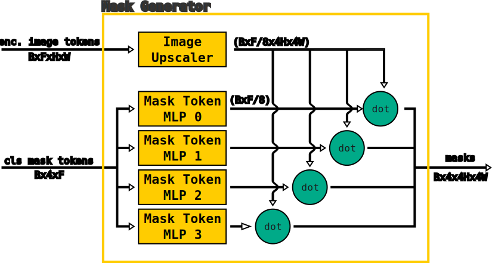

In the image above, the unstacking/stacking of the mask tokens is indicated with splitting/merging lines for simplicity. The mask token MLP blocks are not shown here, but they are structurally identical to the [IoU MLP](https://github.com/heyoeyo/muggled_sam/tree/main/muggled_sam/v1_sam#iou-mlp) shown further below, except they reduce the channel count by a factor of 8 (256 down to 32, by default) to match the effect of the upscaler. An interesting take away from this model is that the only difference between the 4 output masks is the dot product operation with each of the mask tokens. This means that these tokens are the _only mechanism_ needed to allow the model to deal with ambiguity, that is, they give rise to the 'whole-part' vs. 'sub-part' masking capabilities.

The image upscaler inside the mask generator does not rely on direct interpolation, instead it uses a sequence of two [2D transposed convolutions](https://pytorch.org/docs/stable/generated/torch.nn.ConvTranspose2d.html). Each of these operations can be thought of as taking a single value and replacing it with a copy of a learned 2x2 set of values which are weighted by the original (single) value. This is analogous to running the [patch embedding model](#patch-embedding-model) in reverse. While replacing each value with a 2x2 pattern does have the effect of upscaling, it's also likely to produce repetitive patterning in the output. This problem is discussed in more detail (along with a potential solution) in the article: "[Deconvolution and Checkerboard Artifacts](https://distill.pub/2016/deconv-checkerboard/)".

  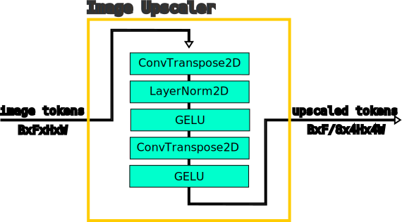

It's worth noting that because the mask outputs are computed via dot products, the outputs are not binary masks but instead take on a range of positive and negative values (the original implementation refers to these as [logits](https://github.com/facebookresearch/segment-anything/blob/dca509fe793f601edb92606367a655c15ac00fdf/segment_anything/predictor.py#L201-L202)). The binary masks come from a post-processing step (separate from the SAM model) where only pixels with values [greater than a threshold](https://en.wikipedia.org/wiki/Thresholding_(image_processing)) (0 by default) are considered part of the mask.

  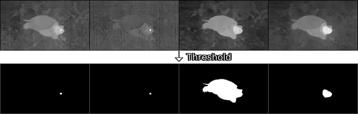

The image above shows an example of the 4 raw mask predictions each normalized to a black-to-white display range (top) and the corresponding binary mask (bottom). All masks use the same prompt (a single point on the eye of the turtle). The raw masks can be visualized, with adjustments to the displayed value range, using the [mask stability](https://github.com/heyoeyo/muggled_sam/tree/main/experiments#mask-stability-visualization) experimental script.

### IoU MLP

The purpose of the [intersection-over-union](https://en.wikipedia.org/wiki/Jaccard_index) [multilayer perceptron](https://en.wikipedia.org/wiki/Multilayer_perceptron) (IoU MLP) is to convert the single encoded IoU token (from the cross-attention transformer) into 4 values, one for each of the output mask predictions. These numbers are meant to be predictions of the IoU between each of the predicted masks and a hypothetical (unknown) ground-truth mask. The model is only 3 [linear layers](https://pytorch.org/docs/stable/generated/torch.nn.Linear.html), with the last layer being responsible for the feature reduction (`F` features, 256 by default, reduced to 4), and uses [ReLU activations](https://pytorch.org/docs/stable/generated/torch.nn.ReLU.html) on the first two linear layers:

  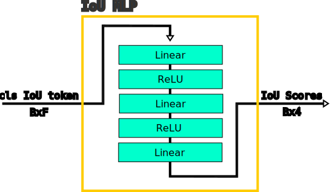

Ideally SAM would always produce masks with IoUs of 100% with their ground-truths. However, in practice this isn't always possible, so this model provides as a way of gauging the 'confidence' of the mask outputs. High IoU scores indicate that the model 'thinks' the corresponding mask prediction closely overlaps with the (unknown) ground-truth, while lower scores suggest the predicted masks may not be very accurate. These scores can be used to automatically select the 'best' mask in cases where user choice isn't practical. Although in some cases, [mask stability](https://github.com/facebookresearch/segment-anything/blob/dca509fe793f601edb92606367a655c15ac00fdf/segment_anything/utils/amg.py#L156) (how much the mask changes when adjusting thresholding) may be a better predictor of the mask quality.

## Image pre-processing

The original SAM model used a somewhat strange approach to pre-processing image data. The model requires an input RGB color image, with a width and height that are both integer multiples of the [patch embedding](#patch-embedding-model) size, which is 16 pixels for all model sizes. In the original implementation, images are always scaled to a square size of 1024x1024 pixels. However, images were not stretched to fit this sizing, instead all images were scaled to fit their largest side into the 1024x1024 square, with the shorter side padded to fill the missing space.

  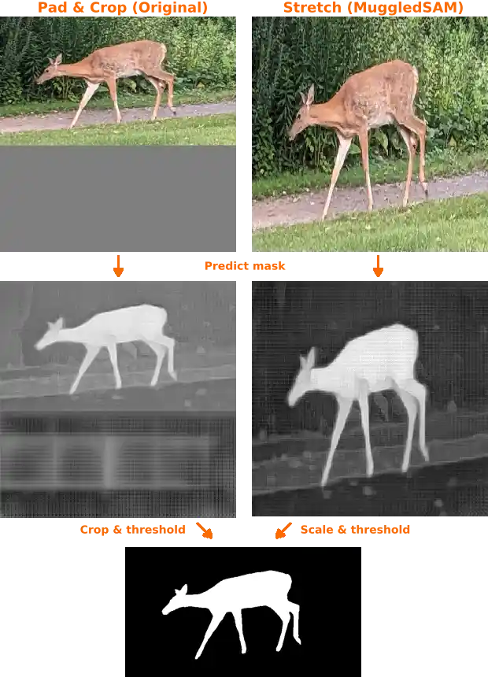

One obvious problem with this padding approach is that some fraction of the image data would hold no useful information, yet still require (heavy) processing by the model. This is especially bad for very short/wide or tall/narrow images. Additionally, the mask generated by the model also included the input padding, which needed to be cropped through a post-processing step.

In this repo, some changes have been made to this pre-/post-processing approach:
1. The model supports inputs that are smaller or larger than 1024 pixels
2. All input images are stretched to fit the specified sizing (e.g. 1024x1024)
3. Inputs can be non-square sizes, for example matching the original input aspect ratio
4. Mask outputs are scaled back to match the input size if needed, with no cropping

In theory, these changes run the risk of breaking the model performance (since it's very different to the training environment). However, in practice, the model seems to tolerate these changes quite well. The simplified implementation and negligible change in the quality of outputs is considered enough to justify the change made here. Worst case scenario, it is still possible for a user to manually pad and crop their inputs to match the original behavior, if needed.