# SAMv1 Components

This folder contains code mostly related to the [attention calculations](https://arxiv.org/abs/1706.03762) used in both the [image encoder](https://github.com/heyoeyo/muggled_sam/tree/main/muggled_sam/v1_sam#image-encoder) and [mask decoder](https://github.com/heyoeyo/muggled_sam/tree/main/muggled_sam/v1_sam#mask-decoder) models. This code has been separated from the main model implementations to help simplify the codebase, as well as providing space for more dedicated documentation around the attention/transformer implementations.

## Image Encoder Attention

This file contains code related to the attention calculations used within the SAM image encoder. This includes the global and windowed attention blocks, as well as the attention calculation itself. Each of these is described in more detail below.

### Attention (with relative position encodings)

Both the global and windowed attention blocks both use a slight variation of the 'standard' attention calculation, which includes an additive relative position encoding term. While the inclusion this term is conceptually simple, [the implementation](#decomposed-relative-position-encoder) is complicated and even prevents the use of more [efficient forms](https://pytorch.org/docs/stable/generated/torch.nn.functional.scaled_dot_product_attention.html) of the attention computation. Unfortunately, the SAMv1 models are therefore slower and use significantly more VRAM as a result of using this variation of attention. The modified equation is as follows:

$$\text{Attention}(Q, K, V) = \text{SoftMax} \left (\frac{QK^T}{\sqrt{d_{k}}} + P \right ) \times V$$

$$ \text{Where } P \text{ is the decomposed relative position encoding term}.$$

Note here that the Q, K and V terms are the standard query, key and value tensors for the [attention calculation](#what-is-attention), only the position encoding term (P) is unique to this variant of attention.

#### Multi-headed attention

In practice, multiple instances of Q, K and V are generated from the input image tokens. The additional instances usually come from partitioning the features of the input tokens, so that each instance of Q, K, V has a reduced feature count. This helps to offset the increase in computation from computing attention multiple times. Each instance independently goes through the attention equation above and the results are then re-combined to restore the original input feature count/shape. This procedure of splitting the input into multiple pieces, computing attention and then re-combining the results is known as 'multi-headed attention'. There is also an extra linear layer applied to the re-combined results (not shown), which likely helps to 'mix' the information contained in the separately processed features.

  

#### What is 'attention'?

While this repo isn't trying to explain every operation from scratch, the attention calculation is a prominent part of transformer models and can seem a bit mysterious, so it's worth discussing briefly here. The explanation here will be very simple, and will only cover the special (but common) case of 'self-attention'. For more details consider checking out the [Illustrated Transformer](https://jalammar.github.io/illustrated-transformer/) or the [Annotated Transformer](https://nlp.seas.harvard.edu/2018/04/03/attention.html) blog posts.

As mentioned above, 'attention' really just refers to an equation. The most basic form of this equation, without fancy scaling or position encodings, is something like:

$$\text{Attention}(X) = \text{SoftMax}((XC_q + B_q)(XC_k + B_k)^T) \times (XC_v + B_v)$$

$$ \text{Where } X \text{ is the input (e.g. image tokens)} $$

For the SAM image encoder the input, X, would be the image tokens arranged into a 2D 'rows-of-tokens' matrix (i.e. each row of X is an image token). The terms: Cq, Ck, Cv are matrices (weights) which are _learned_ as part of the training process, likewise for the bias terms: Bq, Bk, Bv. Typically the [XC + B] patterns are combined into new terms called: **query** (Q = XCq + Bq), **key** (K = XCk + Bk) and **value** (V = XCv + Bv), giving the equation:

$$\text{Attention}(Q, K, V) = \text{SoftMax}(QK^T) \times V$$

While this still looks a bit cryptic, we can oversimplify by saying that the equation can be thought of as a 'find-and-replace' operation. The [softmax](https://en.wikipedia.org/wiki/Softmax_function) and everything inside it is the 'find part', while the multiplication with V is the 'replace part'. The terminology used to describe the components hints at this, for example the query (Q in the equation) is like the 'thing you're trying to find', the keys (K) is the 'thing you're searching in' and the value (V) is the 'replacement value'. So for example, if you had a text document containing the word "hello" and you wanted to replace every instance in the document with the word "world", then the query is "hello", the key is the entire document and the value is "world".

In the context of the SAM model, everything is a token, specifically an [image token](https://github.com/heyoeyo/muggled_sam/tree/main/muggled_sam/v1_sam#patch-embedding-model) which is a bit like a pixel of an image. So for the attention calculation, the thing we're searching _for_ is a set of image tokens (the query Q), we're searching _in_ image tokens (the key K) and we'll replace values _with_ image tokens (the value tokens V). So the input to the attention calculation is a set of image tokens and the output is a set of modified image tokens.

  

It's very helpful to understand what the inputs and softmax result actually 'look like'. The Q, K and V tokens are just an alternate arrangement of the image tokens, with each also undergoing a linear transformation (i.e. XC + B). This arrangement can be described as a 'rows-of-tokens' format, where each row is one image token and the columns hold the feature values. Each of the Q, K and V inputs are therefore just 2D matrices, with N (number of tokens) rows and F (features per token) columns.

The result of the softmax is a _square_ matrix, and it has a special property which is that the values of each row add up to 1 and every value is positive. This means that each row acts like a weighting vector when used in matrix multiplication. This matrix has side lengths equal to the total number of image tokens and each entry in the matrix can be thought of as holding the answer to the question "how similar is this image token to this other token?". Specifically, the ith row and jth column says how similar the ith query token (from Q in the equation above) is to the jth key token (from K).

  

Since the softmax result is like a set of weightings and these are multiplied into the value tokens, it's as if the multiplication 'picks out' parts of the value tokens based on which values are most highly weighted. Hence the 'find' (compute weightings) and 'replace' (output weighted value tokens) analogy. It's important to note however, that this find-and-replace is not binary (e.g. found a match or not) like searching in a text document. Each token 'finds' some amount of what it's looking for in _all_ other tokens and is replaced by a mixture of _all_ value tokens. So attention can introduce a sort of spatial mixing of information across tokens.

### Global & windowed attention blocks

The global and windowed attention blocks include the attention calculation described above, along with some relatively simple [layernorms](https://pytorch.org/docs/stable/generated/torch.nn.LayerNorm.html) and [residual connections](https://en.wikipedia.org/wiki/Residual_neural_network) (also called 'skip' connections). The diagram below depicts both the global and windowed attention blocks:

  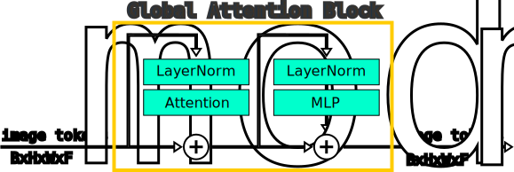

  

As indicated, the windowed blocks are simply global blocks with a windowing step before and after to undo the windowing.

#### Windowing

Windowing is an optimization technique used to reduce the amount of computation and memory needed to execute an attention block. The idea is based off a simple observation: each token must 'attend' to every other token, which means that for N tokens, there are N2 comparisons (computations) required. This scales poorly with the number of tokens! At the same time, it seems reasonable to assume that for any given token, only tokens which are 'close by' are most relevant for processing. Therefore, the idea of windowed attention is simply to have every token only attend to some fraction of the total token count.

  

There are many ways to do this, but the most common approach is to break the image tokens apart into equally sized regions, called windows, then compute attention on each of these as stand-alone inputs. The results on each window are then stitched back together into the original input shape to form the final output. It's possible (and even quite likely due to the model configuration) that the input image cannot be broken into equally sized regions, in these cases the tokens are zero-padded (on the bottom and/or right) in order to get a shape which divides evenly into the chosen window sizing. For example, in the image above, the input grid is 3x3 and the window size is 2. The input must be padded on both the right and bottom edges to make it 4x4, so that it can be broken into 4 windows, each 2x2 in size.

By comparison, in the original SAMv1 model all stages use a window size of 14. This means that the default 64x64 token grid must be padded to a size of 70x70 to be cleanly divisible by 14. The 70x70 token grid is then broken into 25 windows each 14x14 in size. The attention calculation updates each of these 14x14 windows independently, which are then recombined back into a 70x70 grid. Finally, the 70x70 grid is cropped back to 64x64 before proceeding through the rest of the model. A [pull request](https://github.com/facebookresearch/segment-anything/pull/594) on the original SAMv1 repo suggests that a window size of 16 (which avoids the need for padding) may improve overall performance. It's possible to adjust the window sizing, per stage, and view the effects on segmentation results using the [window sizing experiment script](https://github.com/heyoeyo/muggled_sam/tree/main/experiments#window-size-visualization).

#### MLP

The [multilayer perceptron](https://en.wikipedia.org/wiki/Multilayer_perceptron) (MLP) near the end of the attention block corresponds to the commonly depicted picture of a [neural network](https://en.wikipedia.org/wiki/Neural_network_(machine_learning)) with multiple nodes connecting from left-to-right. In the case of the attention block, the left-most nodes correspond to the feature values for a single token. For the SAMv1 image encoder, every attention block ends with one of these MLP models, which itself contains 2 linear layers with the first using a [GELU](https://pytorch.org/docs/stable/generated/torch.nn.GELU.html) activation function. The first layer also quadruples the feature count, while the second layer restores the original feature count. The diagram below depicts an input feature count of only 2 (in practice there are hundreds!), with quadrupling on the first layer, and only one set of input/output connections is shown to reduce visual clutter:

  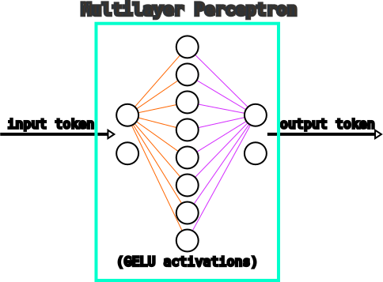

Despite the exotic appearance of diagrams like these, the mathematical implementation is rather simple and boring... It's just matrix multiplication, followed by a [GELU function](https://paperswithcode.com/method/gelu), followed by another matrix multiplication:

$$ \text{MLP}(X) = \text{GELU}(X \cdot A) \cdot B $$

$$\text{Where } X \text{ is an image token, } A \text{ and } B \text{ are (learned) 2D matrices}$$

In the context of the attention block, it's a somewhat mysterious component, especially because it acts on each token independently (e.g. it isn't mixing information spatially). There's an interesting video by the YouTube channel [3Blue1Brown](https://www.youtube.com/watch?v=9-Jl0dxWQs8) about how the MLP may be used to 'store facts' in _language models_. For SAM (and image encoding more generally), the equivalent functionality may be to store an understanding of specific image pieces, for example like recognizing the sky or whether an image patch describes the front or back of a particular object.

  

Progressively reducing the influence of the MLP (by simply [scaling it](https://github.com/heyoeyo/muggled_sam/blob/dbf5c187d78717b3606559fb86fb11fe3c666aff/lib/v1_sam/components/image_encoder_attention.py#L61) within the attention blocks) produces results which maintain a correspondence with the prompt positioning, but which steadily corrupt the object segmentation boundary as seen in the animation above. Interestingly, the MLP must be scaled by a factor of around 0.4 or lower before any obvious signs of degradation begin to appear. The 'blurring' of the mask prediction (especially visible in the background elements in the animation above) while still adhereing to the box prompt region does hint that the MLP may play a role in 'understanding' object boundaries.

## Decomposed Relative Position Encoder

This script contains an implementation of the 'decomposed' relative position encodings used inside the image encoder attention calculation. This component is arguably the single most complex piece of the entire SAM model, so it has been separated for clarity.

The use of relative position encodings is nothing new, however the specific implementation used here _is_ unusual and seems to originate from the paper: "[MViTv2: Improved Multiscale Vision Transformers for Classification and Detection](https://arxiv.org/abs/2112.01526)". In this paper, they (quite briefly!) describe the concept of a 'decomposed relative position embedding' (see page 3 of the paper). This is meant to be a term added within the attention calculation, following the given equations:

$$\text{Attention}(Q, K, V) = \text{SoftMax} \left (\frac{QK^T + E}{\sqrt{d_{k}}} \right ) \times V$$

$$\text{where } E_{ij} = Q_i \times R_{p(i)p(j)} $$

$$\text{and } R_{p(i)p(j)} = R^h_{h(i)h(j)} + R^w_{w(i)w(j)} $$

The Q, K, V and dk terms are all the same as in 'regular' attention (see "[Attention Is All You Need](https://arxiv.org/abs/1706.03762)"), with the unique modification being the additive position encoding term they call: E. To be clear, this additive term is just a square 2D matrix, with the number of rows and columns equaling the total number of image tokens. The word 'decomposed' refers to the fact that there are not uniquely learned encodings for every possible (∆x, ∆y) relative positioning. Instead, encodings are only learned for all possible ∆x values and, separately, all ∆y values. Then, for any given (∆x, ∆y) position, the encoding is produced by adding the separate ∆x and ∆y learned encodings.

  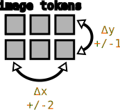

Relative position can sometimes be a confusing idea, but it simply refers to row or column spacing between one token and another in the 2D grid of tokens. Consider a set of image tokens with a grid height of 2: then the furthest any pair of tokens could be away from each other is +/- 1 cell in the height (or y) direction. If the grid width is 3, the furthest distance is +/- 2 cells in the width (or x) direction. All other distances are also possible, so for example in the height direction two cells could be -1, 0 or + 1 cells apart, in width they could be -2, -1, 0, +1 or +2. Each of these values corresponds to a unique 'relative position' for pairs of tokens. The positive and negative values account for fact that one token is always thought of as the 'origin', so that the other token could to the left (-) or right (+) or above/below.

### Example

The table below shows hard-coded (as opposed to learned) 'position encoding' values that will be used for this example. This table includes values for each of the possible ∆x and ∆y offsets of a 2x3 set of image tokens:

  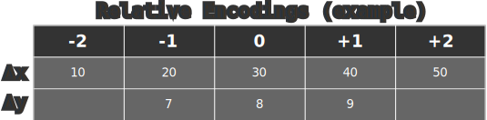

In practice, the position encodings are not single integer values but instead each encoding is an entire vector of values (e.g. an embedding). Integers are used here to make it easier to see how the final encodings are constructed. Also note that there are no encodings for ∆y values of +/- 2, since these offsets aren't possible if we assume a grid height of only 2.

From these two listings, we can construct a table (the **pair encodings matrix**) of all possible ∆x and ∆y combinations by adding (see the Rp(i)p(j) equation above) the corresponding encoding from the two listings above:

  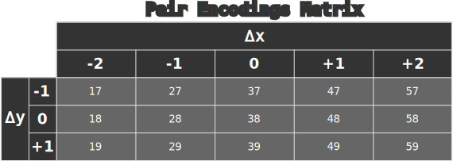

For example, the second row, fourth column entry (48) would be the position encoding for any pair of tokens which have a relative x distance of +1 (corresponding to a query token being one cell to the right of a key token) and a relative y distance of 0 (query and key occupying the same row). Notice that there is a clear 'counting pattern' occuring both left-to-right and top-to-bottom in this table, due to the patterns in the individual ∆x and ∆y encoding values from the previous table. This is a consequence of this 'decomposed' approach to the position encodings. To be clear, this matrix is _not the same_ as the Eij matrix from the equations above (but is required to produce it).

So far, so good, however what makes these decomposed position encodings especially complicated is both the multiplication of the encodings by the query tokens (see the Eij equation above), as well as the arrangement of the encodings needed to match the attention matrix layout.

  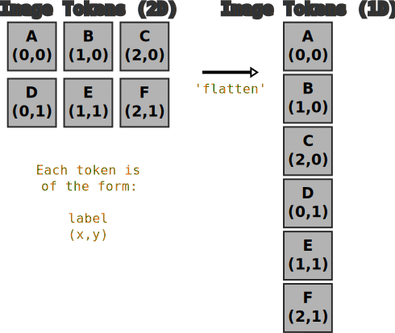

To understand the attention matrix layout, it's important to realize that the rows and columns correspond to a 1D 'flattening' of the 2D arrangement of image tokens (i.e. from the 'rows-of-tokens' format). The image above indicates this flattening process, along with showing how the (x,y) coordinates are distributed in the resulting 1D arrangement. The (∆x, ∆y) values associated with each cell can be obtained by subtracting the x & y coordinates of a given row by the x & y coordinates of a given column:

  

Note that the listings along the top row/left column corresponds to the 'flattened' image token sequence. Each cell holds the ∆x and ∆y positions of each query token (rows) compared to every key token (columns).

Each of the (∆x, ∆y) pairs in this matrix is used as an _index_ into the **pair encodings matrix** we computed earlier. For example, the relative position of query token B to key token D is (∆x = 1, ∆y = -1) according to the matrix above. Looking this up in our ∆x/∆y table from earlier, we would say that the position encoding for this cell should be the value: 47, and this can of course be repeated for all other cells. Finally, to complete the construction of the 'decomposed relative position encodings', the query tokens must be multiplied into these values according to the equation from MViT2, which says that the query token associated with each row must be multiplied into the value we get from the pair encodings matrix, giving us something like:

  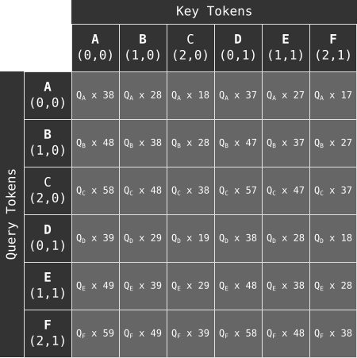

Notice that on each row, the same query token (for example, query token A, written as QA) is multiplied into each of the values we get from the pair encodings matrix. In practice, the multiplication is actually a _dot product_ between the query token and the position encoding. The result is that each cell contains a single scalar value. And at last, the position encoding is complete!

#### Efficient implementation

Surprisingly, there's even more to the decomposed position encodings! The approach described above would be too memory hungry to implement in practice, due to maintaining multiple large matrices (each encoding is a large vector in practice!), so the actual implementation is quite a bit more [cryptic](https://github.com/facebookresearch/segment-anything/blob/dca509fe793f601edb92606367a655c15ac00fdf/segment_anything/modeling/image_encoder.py#L349-L359) in order to improve efficiency.

The insight for reducing memory usage comes from recognizing that many of the position encodings are repeated, and therefore don't need to be stored multiple times. For example, looking at the query-key (∆x, ∆y) matrix from earlier, we can see that in the top-most row, the ∆y value only ever takes on a value of 0 or -1. Similarly, along the left-most column, the ∆x values of 0, 1 and 2 are repeated twice. In fact, this pattern of 3 ∆x values repeating twice and 2 ∆y values repeating three times holds for any row or column! We originally computed the results following something like:

$$ Q_i * (\Delta x + \Delta y)$$

Where we compute all (36) of the ∆x + ∆y terms first (and stored them) and then multiplied in the Qi values. Instead, we could imagine the operation as:

$$ (Q_i * \Delta x) + (Q_i * \Delta y)$$

Though this produces the same result, it can be done with far less storage. For example, we can see that for any given Qi there are only 3 ∆x values and only 2 ∆y values that need to be considered. Since the dot product gives a single number as a result, it's also far more memory efficient way to build up to the final output. The way this is done is extremely unintuitive however! It begins by forming two matrices out of all possible ∆x and ∆y, which can be done using a similar 'subtract the column indices from the row indices' trick from earlier:

  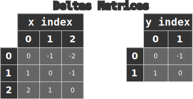

Then each of these needs to be multiplied (via dot product) with the appropriate Qi tokens. For example, using the table we already constructed earlier, we saw that QA needs to be multipled by the ∆x encodings of 0, -1, and -2 and the 0, -1 ∆y encodings. The QB token needs to be multiplied by the 1, 0 and -1 ∆x encodings and the 0, -1 ∆y encodings and so on. Figuring out which ∆x/∆y values pair with which tokens and efficiently performing the dot products is tricky without constructing the full table like we did earlier. However, it's possible to figure out by imagining the operation in 3D:

  

  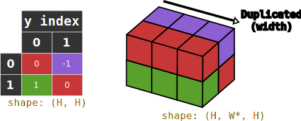

The diagrams above show the ∆x and ∆y tables, where the tables have been duplicated along one axis to create a 3D structure. The orientation of these shapes (relative to the original tables) may be counter-intuitive (especially the ∆x structure), so color coding has been added to help make sense of things. The shapes of the original tables as well as the 3D shapes is shown, where the dimensions: H* and W* are used to indicate duplicated dimensions. The shape ordering, in 3D, is meant to be interpreted as: (height, width, depth).

  

  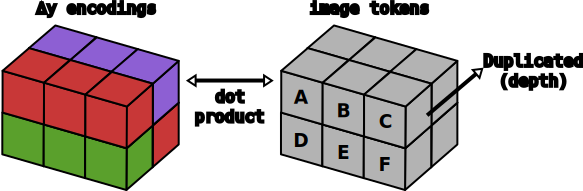

The image tokens are duplicated in the 'depth' dimension to match these 3D structures and a dot product is imagined being performed between the image tokens and ∆x or ∆y blocks in matching positions. In reality, the values don't actually need to be duplicated, instead the operation can be performed efficiently using an [einsum](https://pytorch.org/docs/stable/generated/torch.einsum.html) operation, the idea of duplicating is just here to help with intuition.

Since we don't actually need the duplication, this approach only requires forming an HxH (ex. 2x2 in this example) grid of ∆y encodings and a WxW (ex. 3x3) grid of ∆x encodings. In total, we need to store (H2 + W2) embeddings in this approach compared to  (H*W)2 in the (simpler to explain) implementation earlier. So 13 vs. 36 in this example, though this is an especially significant reduction as the grid size is increased!

After performing these dot products, we end up with results shaped like: HxWxW and HxWxH (for ∆x and ∆y respectively) of scalar values. These results still need to be added together to form the final 6x6 attention-shaped grid that we ended with in the simpler explanation. A similar 3D interpretation can be used to understand how this addition step works, though it's more mind-boggling than before. To get the 6x6 shaping, we first start by 'flattening' the 3D structures into a rows-of-tokens format, but only for the height and width dimensions. Flattening results in 2D arrangements, but we keep the data in 3D since it helps imagine another duplication step:

  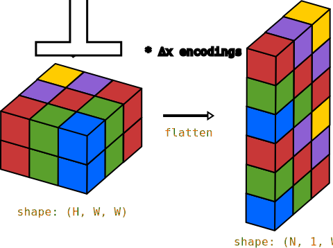

  

These structures are now thought of as having an Nx1xW or NxHx1 shaping (6x1x3 and 6x2x1 in this case). Next, we again imagine duplicating these structures along one axis so that they both have a NxHxW shape. As before, the duplication isn't literally needed, though we're dealing with scalar values now so storage isn't much of a concern anyways:

  

Since both structures have matching shapes, they can be pointwise added together. And lastly, the now combined NxHxW (here: 6x2x3) result can _again_ be flattened, this time along the trailing HxW dimensions, so that we get our final 6x6 position encoding. This will produce a result exactly matching the 'inefficient' approach we described earlier, but with far less memory use!

It seems fair to say that this is an overcomplicated approach to position encodings and may partly explain why [SAMv2](https://github.com/heyoeyo/muggled_sam/tree/main/muggled_sam/v2_sam) switched to a different image encoder (which claims to work '[without the bells and whistles](https://github.com/facebookresearch/hiera)').

#### A slightly different equation

Finally, it's worth noting that in the [SAMv1 implementation](https://github.com/facebookresearch/segment-anything/blob/dca509fe793f601edb92606367a655c15ac00fdf/segment_anything/modeling/image_encoder.py#L231-L234) (and even the [MViT2 code](https://github.com/facebookresearch/mvit/blob/19786631e330df9f3622e5402b4a419a263a2c80/mvit/models/attention.py#L281-L291)!) the equation used for attention does **not** scale the position encoding (E) term by dk as suggested by the equation presented in the MViT2 paper. Instead, the position encodings are added _after_ the Q, K multiplication and scaling. To avoid confusion with the original equation, in this repo, the equation is therefore given and computed using:

$$\text{Attention}(Q, K, V) = \text{SoftMax} \left (\frac{QK^T}{\sqrt{d_{k}}} + P \right ) \times V$$

Where P is the additive position encoding term (without any scaling).

## Cross-Attention Transformer

The cross-attention transformer inside the mask decoder is used to mix information between the encoded prompts and encoded image data. This is the reason why the segmentation seems to 'respond intuitively' to input prompts, for example segmenting things near a given point prompt and not an unrelated object elsewhere in the image. The transformer consists of only 2 sequential blocks and a final cross-attention block to further enrich the prompt tokens:

  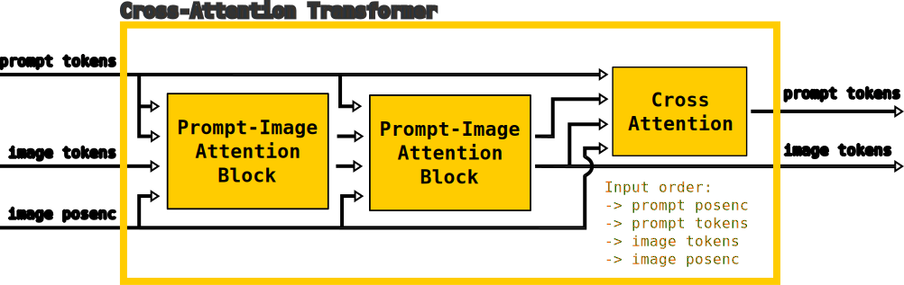

The data flow through the cross-attention transformer is somewhat complex. Importantly, the prompt tokens, prompt position encodings, image tokens and image position encodings are used repeatedly through the model, in both the prompt-to-image attention blocks as well as the final cross-attention block, with the ordering listed in the diagram above. Confusingly, the prompt position encodings are the [tokens themselves](https://github.com/facebookresearch/segment-anything/blob/dca509fe793f601edb92606367a655c15ac00fdf/segment_anything/modeling/transformer.py#L95)! The prompt tokens do contain positioning information, via the [coordinate encoder](https://github.com/heyoeyo/muggled_sam/tree/main/muggled_sam/v1_sam#coordinate-encoder), but also include [additive embeddings](https://github.com/heyoeyo/muggled_sam/tree/main/muggled_sam/v1_sam#prompt-encoder) which makes them a strange choice to use directly as position encodings. Most likely, it would be better to just use the coordinate encodings (which is exactly what the image position encoding is), but the tokens were used instead because the coordinate encoder and prompt encoder are combined in the original implementation and separating them would have been difficult.

### Prompt-to-image attention block

As the name suggests, the prompt-to-image attention block is responsible for mixing information between the image tokens and prompt tokens. It consists of several attention block variations (described in the section below) chained in sequence:

  

For clarity, the diagram above avoids criss-crossing the inputs, but it's important to note that the first and last cross-attention blocks have different input orderings! The cross-attention block can be thought of as outputting 'enriched query tokens'. So the first block uses the prompt tokens as the query input, while the image tokens are the query input for the last block (even though the diagram suggests the input orderings are the same).

Another important note, not shown in the diagram, is that the first self-attention block _does not use_ the position encodings when it's the first block in the larger [cross-attention transformer](#cross-attention-transformer) model. This is a strange (and seemingly overcomplicated...) quirk in the design of the original model.

The 'MLP (normed)' block is not shown, but is simply a standard [multilayer perceptron](#mlp) followed by a [layernorm](https://pytorch.org/docs/stable/generated/torch.nn.LayerNorm.html). The other blocks are described in the sections below.

## Mask Decoder Attention

This file contains the code which implements the attention calculations within the mask decoder (or more specifically, the [cross-attention transformer](#cross-attention-transformer)  within the decoder). Unlike the attention calculations inside the image encoder, the mask decoder makes use of both self-attention as well as cross-attention. These implementations are detailed below.

### Generic attention

Up until this point, all discussion of [attention](#what-is-attention) has been about the special (but common) variant called: self-attention. The mask decoder uses a more generic attention model implemented in such a way that it can support both self-attention as well as cross-attention, simply by providing the appropriate tensors used as the query, key and value inputs for the attention calculation. For typical self-attention, all three inputs would be the same, for example. The computation of generic attention is the same as the original "Attention Is All You Need" description, without any extra position encodings:

$$\text{Attention}(Q, K, V) = \text{SoftMax} \left (\frac{QK^T}{\sqrt{d_{k}}} \right ) \times V$$

However, when used for _cross-attention_, the sizing of the query tensor may not match the key & value tensors. More specifically, the shape of Q is `Nq x f`, while the shape of both K and V is `Nk x f`, where `Nq` and `Nk` are the number of tokens and `f` is the number of features per token (per head). The most important thing to note here is that the result of the calculation will have a shape of `Nq x f`, that is, it matches the query input. Therefore when used for cross attention, we can think of the process as enhancing or enriching the query input using information from the key/value input.

There are three ways the mask decoder uses this attention calculation, all with minor differences:

#### Cross-Attention variant

Although the attention calculation used within the mask decoder does not explicitly include position encodings, two of the variants used within the decoder make use of additive position encodings on the inputs, prior to the attention calculation itself. Each variant also applies a layernorm to the attention results:

  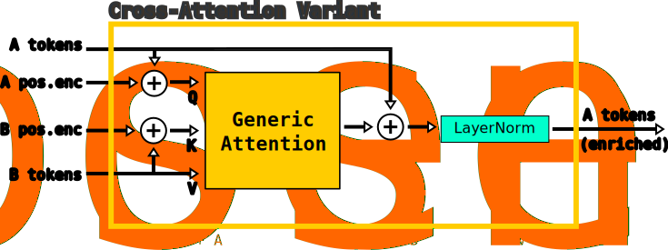

Note that the inputs are shown as 'A tokens' and 'B tokens' to keep the implementation general. For example, in some cases the 'A tokens' might be prompt tokens, in other cases they could be image tokens. Both the query (Q) and key (K) are derived by adding the A and B tokens with a position encoding term, while the value input (V) does not use position encodings. Additionally, there is a residual step, where the input A tokens (without position encoding) is added to the attention result before passing through a layer normalization step.

As mentioned above, cross-attention can be thought of as 'enriching' the query input, or the 'A' tokens in this case. So for example, if image tokens are provided as the 'A' input and prompt tokens are provided as the 'B' input, then this cross-attention block would be enriching the image tokens using information from the prompt tokens.

#### Self-Attention with position encoding variant

The self-attention (with position encoding) variant is the same as the cross-attention version, except there is only a single set (A) of tokens:

  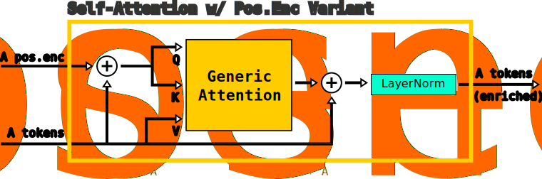

#### Self-Attention without position encoding variant

There is a second self-attention variant that does not include position encodings for some reason, nor does it include a residual connection like the other two variants. This block is also only included when it's the first block of the sequence of processing:

  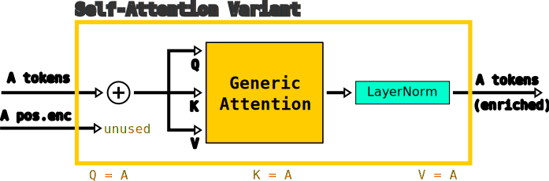

This variant still includes a position encoding input even though it's not used. This is done to match up with the other variant of self-attention, so they can be used interchangably within the model, without requiring any changes or conditional checks.

## Shared

This file contains generic model components that are used throughout various parts of SAM.

### LayerNorm2D

This is a combination of a 'per-token' normalization with linear scaling and offset. It's used to improve the training process as described in the paper "[Layer Normalization](https://arxiv.org/abs/1607.06450)". PyTorch has a built-in [LayerNorm](https://pytorch.org/docs/stable/generated/torch.nn.LayerNorm.html) implementation, however the '2D' version here is modified to support 'channels-first' image-like shapes. That is, tensors with a shape like: BxCxHxW, where B is the batch dimension, C is channels (or features per token) and H & W are the height and width of the grid of tokens. This layernorm also uses a smaller `eps` value compared to the PyTorch default, which is used to prevent divide-by-zero errors. The equation used for LayerNorm2D, when applied to a single token (i.e. a vector) is as follows:

$$\text{Let } Z = Token - \text{mean}(Token) $$

$$\text{LayerNorm2D}_{(\text{applied to each token})} = \frac{Z}{\sqrt{\text{mean}(Z^2) + 1e^{-6}}} \times W + B $$

$$\text{Where the mean is taken along the channels/features of each token} $$

$$\text{and the W, B terms are applied point-wise} $$

Note that this is a bit like a normalization and linear scaling + offset, if we instead write:

$$\text{LayerNorm2D}_{(Token)} = \text{normalize}(Token) \times W + B $$

It's important to note that the layernorm is applied to all tokens, so each token is normalized independently, but they all use the same weights (W) and bias (B) values. It's also important to recognize that the weights are only a _vector_ of values which are point-wise multiplied into the token values. This is in contrast to a [linear layer](https://pytorch.org/docs/stable/generated/torch.nn.Linear.html), where the weights would normally be a full matrix of values.

### Conv1x1

This module is provided purely for readability in the codebase. It's simply a regular (built-in) [Conv2D layer](https://pytorch.org/docs/stable/generated/torch.nn.Conv2d.html), with the kernel size and stride hard-coded to a value of 1. The reason for giving this a distinct name is that 1x1 convolutions don't really _do_ convolution. They're equivalent to linear layers acting on the channel values of the tokens, and so don't perform the spatial mixing of information implied by seeing a 2D convolution layer in a model.

So why not just use a linear layer? A 1x1 convolution layer acts on image-like inputs with 'channels-first' shapes, that is: BxCxHxW. While a linear layer would require a 'channels-last' ordering: BxHxWxC. In cases where the input already has a channels-first shape, it's convenient to use a 1x1 convolution instead of re-arranging the dimensions to work with a linear layer.

