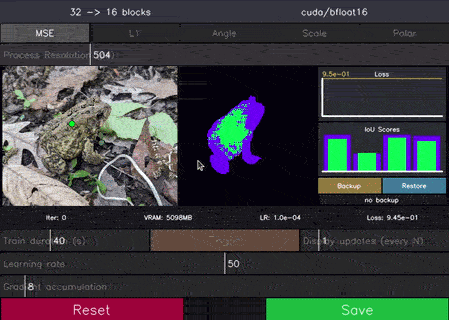

# MuggledSAM - Training

This folder contains some experimental scripts that are specific to training/fine-tuning the SAM models. It currently supports (very basic) distillation of the SAMv3 image and/or text encoders.

The idea with distillation is to create a smaller 'student' version of a SAM model and use a larger 'teacher' for training the student model. The teacher acts as ground truth, and so distillation can potentially be done without needing anything other than input data (text or images, for example).

Distillation is handled as a 3-part process in this repo:
1. Use the pruning scripts to create copies of SAMv3 with a smaller image or text encoder
2. Use the distillation scripts to train the smaller (student) model to match the output of the original (teacher) model
3. Use the merge script to combine the trained weights back into the student model to produce a new standalone model that can be used in other scripts (or even with the original SAM3 codebase!)

Each of the scripts associated with these steps is described in more detail below.


## Pruning

_(Supports SAMv3)_

There are two pruning scripts used to prune either the text or image encoder of SAMv3. These are purely terminal based and can be run using (in a terminal):

```bash
python3 prune_text_encoder.py
```
or
```bash
python3 prune_image_encoder.py
```

Pruning primarily works by keeping only a subset of the original transformer blocks of either the text or image encoders. This can work surprisingly well, as the later transformer blocks typically have very little effect on the model output. The choice of which blocks to keep is configurable, with a number of default mappings provided when the scripts are first run.

These scripts also support reducing the feature counts used by the encoders (see the `-h` flag for more info). This is done in a simplistic way and tends to have a very negative impact on the model performance (much more so than removing entire blocks). It can be hard to recover the lost performance when doing this, so it's meant as more of an advanced option. For patient users, it may be possible to iteratively reduce the feature count by a small amount, followed by training to correct the model errors, followed by another feature count reduction etc. However, large feature count reductions will likely require a full fine-tuning using ground-truth masks (not supported in this repo) to work properly.

The models produced by these scripts are still usable with the original SAMv3 codebase, but may require changes to the original codebase to load correctly. The required changes will be printed out in the terminal when saving pruned models.

## Distillation

_(Supports SAMv3)_

<p align="center">
  
</p>
<p align="center">(This animation shows 40 seconds of training the image encoder on coco128, sped up by a factor of 6)
</p>

There are two scripts that allow for distilling either the text or image encoder of SAMv3 using an interactive UI. To use the scripts, run:

```bash
python3 distill_text_encoder.py
```
or
```bash
python3 distill_image_encoder.py
```


There are several optional flags that can be given to adjust the behavior of these scripts, which can be seen by running the commands with the `-h` flag. For example, adjusting the `-r` (lora rank) flag can have a significant impact on training results. When distilling the image encoder, the `--low_memory` flag can be used to reduce the memory requirements down to around 4GB at the expense of slightly slower training speed.

When training the image encoder, a visualization of the student mask and IoU predictions is shown (similar to the [run_image](https://github.com/heyoeyo/muggled_sam/tree/main?tab=readme-ov-file#run-image) script). When training the text encoder, the detection scores are shown along with box or mask predictions (similar to the [run_detections](https://github.com/heyoeyo/muggled_sam/tree/main?tab=readme-ov-file#run-detections) script). The 'teacher' model predictions are shown in purple, with student predictions shown in green (when matching) or red (when not matching). These are updated in real-time as training progresses. The script allows for changing the loss function and learning rate in real-time and has support for recording backups to allow for quickly testing out different configurations and restoring prior states if needed.

> [!Tip]
> The text encoder runs _significantly_ faster so it's best to start with the text encoder if you'd like to get a sense of how training works


### Input requirements (Image encoder)

Training the image encoder requires several resources (the script will prompt for these on startup):

1. A path to a test/validation image. This is used to provide visual feedback about the performance of the student model during training, it doesn't directly affect the results in any way.

2. A path to images used for training. This can be a path to a folder containing images, or otherwise a path to a text file that lists paths to the images. These should only be actual images and not masks (this distillation script doesn't use masks). The images provided here are what the student model will 'get good at'. A simple starting set of images (if not using your own) would be [COCO128](https://cocodataset.org/#home) which is a small dataset that can be downloaded from places like [ultralytics](https://github.com/ultralytics/yolov5/releases/tag/v1.0), [roboflow](https://universe.roboflow.com/team-roboflow/coco-128/dataset/1) or [kaggle](https://www.kaggle.com/datasets/ultralytics/coco128). 

3. A path to a student model. The student should be made by running the image encoder pruning script to produce a smaller version of the original SAMv3 model. The smaller the student model, the more difficult it will be to train to match the original SAMv3 model (but it will also run faster).

4. A path to the teacher model. This script trains the student model to mimic the teacher, so it acts as the 'ground truth' for training. Generally this should be the [original SAMv3](https://github.com/heyoeyo/muggled_sam?tab=readme-ov-file#model-weights) model (e.g. `sam3.pt` file).

Optionally, a path to masking prompts can be provided. This can be used to set up initial point or box prompts and is helpful when trying to maintain consistency across different runs of the script (e.g. making sure to use identical prompts between runs). See the `-h` flag printout for more details. Alternatively, it's possible to directly click on the image during training to adjust the prompts that are being used.

### Input requirements (Text encoder)

Training the text encoder requires similar inputs:

1. A path to a test/validation image.

2. A text prompt used for testing/validation. This controls what gets visualized during training. The text prompt can be updated after launching the script (see the instructions printed in the terminal after start-up for more info).
3. A path to the student model.

4. A path to the teacher model.

Optionally, a path to training text prompts can be given. This is analogous to the folder of training images in the case on the image encoder. If a path isn't given, then a default set of training text is used instead. See the `-h` flag for more details about how to provide this path.

> [!Tip]
> The testing results can be dramatically altered depending on whether the test prompt is in the training data or not. Try it for yourself!


### Final trained weights

At any point during training, the current 'weights' can be saved. However, this only saves [LoRA](https://arxiv.org/abs/2106.09685) components, not a full model! This is done to allow for saving many files without excessive disk usage (the LoRA weights are only 10-100 MB), but they are not usable on their own. To get back a full trained model, use the merging script (see below)


## Merging weights

_(Supports SAMv3)_

Unlike the other steps, there is only 1 merging script. This is used to merge trained weights (either for the image or text encoder) back into a student model to create a new model for use in other scripts (or even with the original SAM3 codebase). This script is entirely terminal based and can be run using:

```bash
python3 merge_trained_weights.py
```

This script needs a path to a 'base' model and the training weights that will be merged into this model. These paths can be provided directly, though menus will be provided if using the default `model_weights` folder.  The resulting model file is structured to be compatible with the original SAMv3 repo, but may require adjustments to the original code to account for sizing changes. These adjustments are reported when creating models with the pruning scripts.